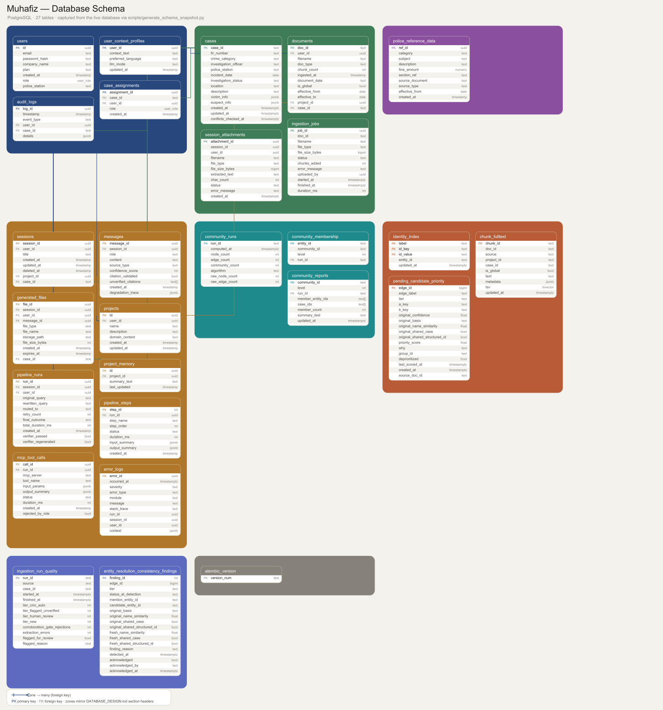

<div align="center">

# Muhafiz

**Evidence Intelligence Platform for Islamabad Police.**

_A case-centric, graph-backed investigative assistant — bilingual (Urdu/English) retrieval over case evidence and reference material, entity/relationship traversal across a case's knowledge graph, a hard grounding gate on every generated answer, and role-based access control down to the individual case._

[](https://www.python.org/)
[](https://fastapi.tiangolo.com/)
[](https://reactjs.org/)
[](https://vitejs.dev/)
[](https://tailwindcss.com/)
<br/>
[](https://www.postgresql.org/)
[](https://age.apache.org/)
[](https://www.trychroma.com/)
<br/>
[](#technology-stack)

</div>

---

## Table of Contents

- [Overview](#overview)
- [Key Features](#key-features)
- [Architecture & Pipeline](#architecture--pipeline)
- [Documents: Knowledge Base vs. Chat Attachments](#documents-knowledge-base-vs-chat-attachments)
- [The Evidence Graph](#the-evidence-graph)
- [Database Schema](#database-schema)
- [Technology Stack](#technology-stack)
- [Project Structure](#project-structure)
- [Setup & Installation](#setup--installation)
- [Configuration](#configuration)
- [API Reference](#api-reference)
- [Admin Dashboard](#admin-dashboard)
- [Known Limitations & Deferred Scope](#known-limitations--deferred-scope)
- [Design System](#design-system)

---

## Overview

Muhafiz began as a police-reference RAG chatbot and has been rebuilt into a **case-centric evidence intelligence platform**: a Case (not a document, not a chat) is the organizing unit every piece of evidence, every graph entity, and every access-control decision attaches to.

Ask a question — in Urdu or English — about a specific case, the law, a procedure, or how entities connect across cases, and Muhafiz routes it to the right source: case-scoped document retrieval, an entity/relationship graph built from the case's own evidence, a structured reference-data lookup, or (for supervisors and above) a cross-case query. Every answer that draws on retrieved evidence — from any of those sources — passes through a dedicated **Verifier** before it reaches the investigator: a hard grounding gate that checks the answer's claims against its cited sources, rejects off-topic or cross-case-leaked content, and abstains rather than guessing when a claim can't be verified.

**Muhafiz does not guess.** If an answer isn't supported by the retrieved evidence, structured reference data, or a credible web source, it says so rather than fabricating a citation — and now, that guarantee is enforced by a dedicated verification step, not just prompt wording.

Access is controlled per case: an investigator sees only the cases they're assigned to (or created); cross-case queries — which can surface a recurring vehicle, phone number, or person across separate investigations — require a supervisor role or higher, are hard-blocked otherwise, and are audit-logged either way. Postgres Row-Level Security backstops the same rule at the database layer.

---

## Key Features

### Case & evidence model

- **Case as the organizing entity.** A `Case` (FIR number, crime category, investigating officer, station, status, victim/suspect info) is created via the API; evidence documents, chat sessions, and graph entities all carry a `case_id`. Retrieval, RLS, and the Verifier's leakage check all key off it.
- **`case_id` composes with the pre-existing project/global scoping** rather than replacing it — a case-scoped query is `case_id == X AND (project match OR is_global)`, so the original multi-tenant knowledge base is untouched.

### Retrieval, routing & language

- **Eight-way routing.** The router classifies every query into one of `DIRECT`, `RAG`, `WEB`, `SQL`, `GRAPH`, `GRAPH_HYBRID`, `XGRAPH` (cross-case graph), or `XAGG` (cross-case aggregate) — plus a `case_scope` (`within_case` by default; only `XGRAPH`/`XAGG` are ever `cross_case`, and that guard is unconditional, not something a malformed router response can bypass). Short conversational messages still fast-path to `DIRECT` without an LLM call.
- **Hybrid retrieval with RRF + cross-encoder reranking.** Semantic (ChromaDB) and keyword (Postgres `tsvector` / BM25) signals fuse via Reciprocal Rank Fusion (k = 60) to a top-10 candidate set, which a **bge-reranker-v2-m3 cross-encoder** re-scores down to the top-5 before the relevance evaluator sees it.
- **Query expansion, self-correcting retry loop, guarded web search, SQL lookups against `police_reference_data`** — all carried over from the original build; see [Architecture & Pipeline](#architecture--pipeline) for how they now fit alongside the graph routes.
- **Bilingual, everywhere.** `preferred_language` drives generation on every route, including the new graph/cross-case branches, not only RAG — plus a language toggle in the chat UI.
- **Urdu-aware text pipeline.** Sentence splitting on Urdu sentence-final marks (`۔ ؟`), a purpose-built regex tokenizer (chosen over `urduhack`/Stanza after evaluating both — see `docs/URDU_TOKENIZATION_DECISION.md`), NFKC normalization (which fixed a real bug: the corpus was stored in Arabic *presentation-form* codepoints that compared equal to nothing), and a Roman-Urdu detection tag written per chunk.

### Knowledge graph

- **Apache AGE graph, on the same Postgres instance** — no separate graph database to run or back up (see [The Evidence Graph](#the-evidence-graph)).
- **Entity extraction**: regex-only structured fields (CNIC, phone, plate, FIR#, dates — never LLM), a statistical NER pass with LLM fallback on low-confidence spans, and few-shot domain-entity extraction (vehicles, weapons, organizations, aliases, incidents).
- **Entity resolution**: CNIC-first with a **hard, structural block on merging two entities with different non-null CNICs** (not a scored signal that could drift), name-fallback tiers for everything else, LLM adjudication only on medium-confidence pairs, and a review queue (with precision/recall against a labeled ground-truth set) for anything not auto-resolved.
- **Append-only versioning.** No edge is ever mutated in place — a new fact supersedes the old one via a `superseded_by` pointer, so "what did the system believe, and from what source, at what point" stays answerable. Timeline events (`OCCURRED_ON`) can be locked by an investigator to block further automatic revision.
- **Cross-case graph traversal & aggregates**, gated to `supervisor` role or higher — a hard `PermissionError` (audit-logged as `authorization_violation`) below that role, not a silent downgrade. Unconfirmed identity links are surfaced as caveats, never presented as confirmed fact.
- **Conflict detection.** Deterministic timeline conflicts (the same resolved incident with contradictory dates) plus LLM-identified narrative conflicts — the latter only written to the graph when the LLM supplies a verbatim quote that's actually found in the source text; a missing or hallucinated quote is rejected, not passed through.

### Grounding & safety

- **Verifier Agent — a hard gate, not a suggestion.** Every route that answers from retrieved evidence (`RAG`, `SQL`, `WEB`, `GRAPH`, `GRAPH_HYBRID`, `XGRAPH`, `XAGG`, and every web-search fallback path) is checked before delivery: claim-to-citation grounding, off-topic/generic detection, cross-case evidence leakage, confidence-appropriate hedging for low-confidence graph links, and temporal validity. It fails **closed** — a JSON-parse failure or a rejected claim serves a safe abstention, never a best-effort guess. `DIRECT` (no retrieval happened) is the one route it doesn't gate.

### Security & access control

- **Role-based + attribute-based access control.** Four roles (`investigator` / `supervisor` / `station-admin` / `platform-admin`); a `case_assignments` table anchors who can see which case. `station-admin` does **not** get blanket case visibility — need-to-know applies to every role below `platform-admin`.
- **Postgres Row-Level Security as a database-level backstop** on `cases`, `documents`, `sessions`, and `pipeline_runs` (`FORCE`d, so it applies even to the table owner), keyed on a `SET LOCAL app.case_id` session variable set fresh on every request.
- **Append-only audit log** — admin actions, case-assignment changes, graph writes, and every cross-case access attempt (granted *and* denied) are recorded.

### Everything carried over from the original build

Multi-step agentic pipeline with externalized prompts, in-chat file generation (PDF/XLSX/DOCX), per-conversation chat attachments (never enter the shared knowledge base), admin-managed knowledge-base ingestion, multi-format document loaders, Projects with rolling project memory, per-user personalization, and a live per-step pipeline trace over Server-Sent Events. See the sections below for what changed in each.

---

## Architecture & Pipeline

```text
USER QUERY (+ active case_id, if any)
    │
    ▼
Load conversation history + project/case context + chat attachments
    │
    ▼
[LLM] QUERY REWRITER — resolve pronouns, translate to English, make standalone
    │
    ▼
[LLM] ROUTER — { route, case_scope: within_case | cross_case, target_entity, output_format }
    │        (short conversational messages fast-path to DIRECT without an LLM call;
    │         every route except XGRAPH/XAGG is forced back to within_case even if the
    │         router mislabels it — the guard runs after route normalization, unconditionally)
    │
    ├── DIRECT / NONE → answer from general knowledge (+ user context, language, attachments)
    │                    — no retrieval, so the Verifier does not gate this route
    │
    ├── RAG           → [LLM] QUERY EXPANDER (n=2) → embed variants → ChromaDB (case-scoped)
    │                    + keyword search → BM25 over candidates → RRF fuse (k=60, top-10)
    │                    → cross-encoder rerank (bge-reranker-v2-m3, top-5)
    │                    → [LLM] RELEVANCE EVALUATOR
    │                         ├─ relevant     → generate
    │                         └─ not relevant → retry loop (feedback-improved query,
    │                               up to MAX_RETRIES) → exhausted → guarded web search
    │                               → safe response
    │
    ├── GRAPH /       → Apache AGE traversal, case-scoped, capped 2-3 hops, confirmed-
    │   GRAPH_HYBRID    SAME_AS-only identity fold (GRAPH_HYBRID also runs vector/BM25 in
    │                    parallel, merged at RRF) → same evaluator gate as RAG → generate
    │                    (falls back to RAG on evaluator rejection)
    │
    ├── XGRAPH        → cross-case graph traversal — supervisor role or higher only (hard
    │                    PermissionError + audit log otherwise); unconfirmed identity links
    │                    surface as caveats, never as fact; never falls back into the
    │                    case-scoped RAG stream, even on Verifier rejection
    │
    ├── XAGG          → cross-case aggregate (recurring vehicles/persons across cases,
    │                    station/status/category counts) — same supervisor-or-higher gate
    │
    ├── WEB           → domain-allowlisted Tavily search → (on failure) Gemini grounded
    │                    search fallback → fully disabled under AIR_GAP_MODE
    │
    └── SQL           → [LLM] parameter extraction → MCP Postgres tool → police_reference_data
                        → no rows / MCP failure → automatic fallback to RAG
    │
    ▼ (every route above that answers from retrieved evidence converges here)
[LLM] RESPONSE GENERATOR (Qalb-8B) — answers only from the evidence it was handed
    │
    ▼
[LLM] VERIFIER — claim-to-citation grounding · off-topic detection · cross-case leakage ·
    │             confidence-appropriate hedging · temporal validity
    │
    ├── grounded      → deliver the answer
    └── not grounded  → serve a safe abstention — never the ungrounded draft
    │
    ▼
Persist: messages, pipeline_runs (incl. verifier_passed / verifier_regenerated),
pipeline_steps, audit_logs · update project memory (background) · background
case-scoped conflict detection (Phase 8)
    │
    ▼
output_format == file_pdf | file_xlsx | file_docx ?
    │ no                                  │ yes
    ▼                                     ▼
Return chat response            [LLM] FILE STRUCTURER → build PDF/XLSX/DOCX
                                          → store + return a download card
```

Most "[LLM]" steps above (rewriter, router, expander, evaluator, Verifier judge, plus the
graph-extraction/adjudication stages) share **one** local Qwen3-14B instance across nine
prompted roles; final response generation is the one step routed to a separate model
(Qalb-8B). See [Technology Stack](#technology-stack).

---

## Documents: Knowledge Base vs. Chat Attachments

Two ways a document can enter Muhafiz. They are deliberately separate systems, and the separation is **structural, not a filter**.

|                | **Knowledge base**                             | **Chat attachment**              |
| -------------- | ---------------------------------------------- | --------------------------------- |
| Added by       | Admin, from the admin panel                    | Any user, from the chat composer |
| Processing     | Chunked → embedded → indexed                   | Text extracted once               |
| Stored in      | ChromaDB collection (+ Postgres `documents`)   | `session_attachments`             |
| Retrievable by | **Everyone** — it answers all users' questions | Only that one conversation        |
| Lifetime       | Permanent, shared                              | Dies with the conversation        |
| Endpoint       | `POST /api/admin/kb/upload`                    | `POST /api/attachments`           |

An attachment cannot leak into another user's answer because it is never written to the collection retrieval reads. Its text reaches the model only through the prompt of its own conversation, clearly labelled as user-supplied and not part of the knowledge base, and capped so a large PDF cannot crowd out retrieved documents.

**Case evidence is a third path, distinct from both.** `ingest_file()`/`ingest_directory()` accept an optional `case_id` that tags the resulting chunks (Chroma metadata + the `documents` row) for case-scoped retrieval and graph extraction. **This is not currently enforced** — `case_id` is an optional parameter, not a required one, at every call site including the admin bulk-ingest path — so evidence *can* be ingested without a case attached. Treat "ingest case evidence with an explicit `case_id`" as an operational discipline for now, not something the code guarantees.

Full detail: [`docs/INGESTION.md`](docs/INGESTION.md).

---

## The Evidence Graph

A separate graph layer runs **inside the same Postgres instance**, via the [Apache AGE](https://age.apache.org/) extension (`evidence_graph`) — not a standalone graph database to install, back up, or monitor. AGE enforces no schema of its own; `docs/graph_schema.md` plus application-layer validation in `src/graph/*.py` is the enforcement, and every writer goes through one shared versioning primitive (`src/graph/versioning.py`), never raw Cypher from elsewhere in the codebase.

**Node types:** `Case`, `Person`, `Vehicle`, `PhoneNumber`, `Address`, `Organization`/`Gang`, `Weapon`, `Incident`, `Document`, `StructuredRecord`.

**Edge types:** `BELONGS_TO_CASE`, `APPEARS_IN`, `ASSOCIATED_WITH`, `SAME_AS` (identity — `pending`/`confirmed`/`rejected`, confirmed-only ever treated as the same real-world entity), `OWNS`/`REGISTERED_TO`, `LOCATED_AT`, `INVOLVED_IN`, `PART_OF`, `OCCURRED_ON` (lockable by an investigator), `CONFLICTS_WITH` (written by Phase 8's conflict detection).

**Every edge is append-only and carries provenance** (`source_doc_id`, and `source_chunk_id` where the extraction traces to a specific chunk) — nothing is ever mutated in place; a superseding write sets `superseded_by` on the prior edge instead of deleting it. Cypher is always parameterized (`age_client.py`'s `execute_cypher(cypher_query, params, columns)`) — request-derived values are bound parameters, never string-concatenated into the query text.

Full schema, the AGE-specific connection quirks it's built around (statement caching, `$1::agtype` casting, first-write label races), and worked traversal examples: [`docs/graph_schema.md`](docs/graph_schema.md).

---

## Database Schema

PostgreSQL (local/self-hosted, reached via direct SQL only) holds all relational data *and* the AGE graph, with full-text search native via Postgres `tsvector`. Vector search runs separately in ChromaDB, not in Postgres.



_ER diagram generated from an earlier snapshot of the database (`scripts/build_erd.py`); it predates the Phase 1/4/6/7/8 schema changes below (cases, case_assignments, audit_logs, verifier fields, the AGE graph) — regenerate it before relying on the image. The column/FK data itself is current: [`docs/schema-snapshot.json`](docs/schema-snapshot.json) is regenerated directly from the live database._

Relationship overview (crow's-foot `<` = the many side):

```text
users ──┬──< sessions ──┬──< messages ──< generated_files
        │               ├──< pipeline_runs ──┬──< pipeline_steps
        │               │                    └──< mcp_tool_calls
        │               └──< generated_files
        ├──< projects ──┬──< sessions (project_id)
        │               ├──< project_memory
        │               └──< documents (project_id)
        ├──< pipeline_runs (user_id)
        ├──< case_assignments ──< cases ──┬──< documents (case_id, nullable — see below)
        │                                 ├──< sessions (case_id)
        │                                 └──< case_assignments
        ├──< audit_logs (user_id, case_id — both nullable FKs, ON DELETE SET NULL)
        └──o user_context_profiles          (1:1 — user_id is the PK)

Decoupled by design (no FK constraint — shown dashed in the diagram):
  session_attachments  ~ sessions/users   -- per-conversation files, never in the KB
  error_logs           ~ runs/sessions/users
  ingestion_jobs       ~ documents

Standalone:
  police_reference_data  -- structured penal-code data, queried on the SQL route via MCP

Not in Postgres tables at all — Apache AGE graph (`evidence_graph`), see
The Evidence Graph section above.
```

Document chunks and their embeddings live in ChromaDB, not Postgres — `documents` only tracks per-file ingestion metadata (status, chunk count, source filename, `case_id`).

**Key tables & indexes**

- **`cases`** — the organizing entity: `case_id` (text primary key, e.g. `CASE-A1B2C3D4` — not a UUID; a human-meaningful code investigators actually search for), FIR number, crime category, investigating officer, station, status, victim/suspect info (JSONB). `documents.case_id`/`sessions.case_id` are nullable, `ON DELETE SET NULL` — deleting a case must not silently delete evidence.
- **`case_assignments`** — `(case_id, user_id, role)`. This, not `cases.investigation_officer` (a free-text field, never checked against a user account), is the *only* mechanism that grants case access — see the caveat under [Known Limitations](#known-limitations--deferred-scope).
- **`audit_logs`** — append-only: `event_type`, `user_id`, `case_id`, `details` (JSONB). Covers admin actions, case-assignment changes, graph writes, and cross-case access attempts, both granted and denied (`authorization_violation`).
- **`users.role`** replaces the original `is_admin` boolean — a Postgres enum (`investigator` / `supervisor` / `station-admin` / `platform-admin`).
- **`pipeline_runs`** gained `verifier_passed` / `verifier_regenerated` (Phase 6) alongside the original per-query columns (routed_to, retry_count, timings) that power the trace panel and every latency chart.
- **ChromaDB collection** (not a Postgres table) — chunk text, 1024-dim embeddings, and metadata (`is_global`, `case_id`, `source_file`, `is_roman_urdu`, etc.) for hybrid retrieval. Postgres does the keyword half via a `tsvector`/GIN-indexed full-text search over the same chunk text; the vector half never touches Postgres.
- **`session_attachments`** — deliberately has **no** foreign key to `sessions`; the missing constraint is the structural guarantee that attachments can never be joined into shared retrieval.
- **`error_logs` / `ingestion_jobs`** — back the admin error history and ingestion status.

**Retired / superseded** — present in the schema but no longer written by anything live:

- **`messages.citation_validated` / `messages.unverified_citations`** — written by the original `citation_validator.py` background task; Phase 6 replaced that mechanism entirely with the Verifier (`pipeline_runs.verifier_passed`/`verifier_regenerated`, checked synchronously and gating). Treat these two `messages` columns as legacy.

Migrations live in two places, and the two have already drifted apart (documented in each new migration's own header rather than silently papered over):

- `alembic/` — the original SQLAlchemy migration chain.
- `migrations/*.sql` — plain SQL, applied via `python scripts/apply_migration.py <file>`. Everything from migration 003 onward (attachments/errors/ingestion-jobs, the case model, the AGE graph, RBAC, verifier fields, RLS policies) lives here, not in Alembic.

---

## Technology Stack

### Backend

| Layer           | Technology                                                                         |
| --------------- | ------------------------------------------------------------------------------------ |
| Framework       | FastAPI (async), Uvicorn                                                              |
| Database        | PostgreSQL (local/self-hosted, relational + Apache AGE graph) + ChromaDB (vectors)   |
| Graph           | Apache AGE — Postgres extension, parameterized Cypher via a dedicated `asyncpg` pool  |
| Data access     | Async SQLAlchemy + asyncpg (direct SQL — the only access path)                       |
| Keyword search  | Postgres `tsvector` · `rank-bm25` (Urdu-aware tokenizer)                             |
| Migrations      | Alembic · plain SQL (`migrations/`)                                                  |
| Structured data | Model Context Protocol (MCP) Postgres server                                         |
| Auth            | JWT in an HttpOnly cookie + double-submit CSRF, bcrypt, slowapi rate limits, RBAC/ABAC (role enum + `case_assignments`), Postgres RLS backstop |

### AI

| Role                                                                                                                                  | Model                     | Notes                                                              |
| --------------------------------------------------------------------------------------------------------------------------------------- | -------------------------- | -------------------------------------------------------------------- |
| Reasoning — router, rewriter, query expander, relevance evaluator, SQL-param extraction, Verifier judge, doc-type classification, NER fallback, domain-entity extraction, resolution adjudication | **Qwen3-14B**              | One local instance, nine prompted roles, served on an OpenAI-compatible endpoint (`LOCAL_LLM_URL`) |
| Generation — the final answer, on every route                                                                                          | **Qalb-8B**                | Separate local endpoint (`LOCAL_GEN_LLM_URL`), so a heavy generation call never blocks a reasoning call |
| Embeddings                                                                                                                              | **multilingual-e5-large-instruct** | Local endpoint (`EMBEDDINGS_URL`), 1024-dim, instruction-prefixed for queries, unprefixed for stored chunks |
| Reranker                                                                                                                                | **bge-reranker-v2-m3**      | Local endpoint (`RERANKER_URL`), cross-encoder re-score of RRF's fused top-10 down to top-5 |
| Sentence splitting                                                                                                                      | Rule-based regex           | No model — `src/ingestion/sentence_splitter.py`                     |
| Cloud fallback (reasoning + generation)                                                                                                 | Groq (LLaMA 3.3 70B) → Gemini | Only on local-endpoint failure; **fully disabled under `AIR_GAP_MODE`**, which fails closed rather than silently phoning a cloud provider |
| Grounded web search                                                                                                                     | Tavily → Gemini grounded-search fallback | Domain-allowlisted; disabled under `AIR_GAP_MODE`                   |

`docker-compose.yml` includes an example `vllm` service definition for serving Qwen3-14B; the e5 embedding and reranker endpoints need their own serving process (e.g. a small FastAPI/sentence-transformers wrapper, or a TEI-style server) — see [Setup & Installation](#setup--installation). API keys for the cloud fallback are rotated automatically on rate-limit (`src/llm/key_manager.py`), so `GROQ_API_KEY_1..n` / `GEMINI_API_KEY_1..n` can be supplied.

### Frontend

| Layer        | Technology                                                        |
| ------------ | -------------------------------------------------------------------- |
| Framework    | React 19 · TypeScript · Vite                                        |
| Styling      | Tailwind CSS, token-driven (see [Design System](#design-system)), light/dark theme toggle |
| State        | Zustand                                                              |
| Realtime     | Server-Sent Events                                                   |
| Admin charts | Recharts                                                              |

---

## Project Structure

```text
muhafiz/
├── admin-frontend/       # Admin dashboard (React, plain CSS, Recharts)
├── alembic/              # SQLAlchemy migration chain
├── archive/              # One-off scripts and superseded docs (gitignored)
├── data/
│   ├── documents/        # Source files for the knowledge base
│   └── generated/        # AI-generated PDF/XLSX/DOCX output
├── docs/                 # Architecture, implementation plan, graph schema, INGESTION.md, DESIGN.md
├── frontend/             # Main chat app (React, Tailwind, Zustand)
│   └── public/brand/     # Logo assets (SVG)
├── mcp-servers/          # MCP server configuration
├── migrations/           # Plain-SQL migrations (case model, AGE graph, RBAC, verifier fields, RLS)
├── prompts/              # All LLM system prompts, externalized
├── scripts/              # Ingestion, migration, evaluation, and maintenance utilities
├── src/
│   ├── api/              # Routes: sessions, profile, projects, cases, case_assignments,
│   │                     #   graph_review, admin, attachments
│   ├── auth/             # JWT, CSRF, password hashing, rate limiting, role-based dependencies
│   ├── data_gateway/      # DataGateway protocol + direct backend
│   ├── database/         # SQLAlchemy models, Postgres engine (incl. RLS session vars), pipeline logger
│   ├── extraction/       # Structured-field regex, doc-type classifier, NER, domain-entity extraction
│   ├── generation/       # PDF / XLSX / DOCX builders
│   ├── graph/            # Apache AGE client, entity resolution, versioning, conflict detection
│   ├── ingestion/        # Loaders, chunker, sentence splitter, Urdu normalizer, tokenizer, ingestion service
│   ├── llm/              # Provider clients (local-first + cloud fallback), key rotation
│   ├── mcp/               # MCP client for the SQL route
│   ├── memory/            # Conversation persistence
│   ├── observability/     # Error capture + analytics aggregation
│   ├── pipeline/          # Orchestrator, router, verifier, xagg, and every pipeline stage
│   └── retrieval/         # Embedder, vector store, BM25, RRF, cross-encoder reranker, graph retriever
├── tests/                # Pytest suite (no network access)
├── docker-compose.yml     # AGE-enabled Postgres + an example vLLM service
└── requirements.txt
```

---

## Setup & Installation

### Prerequisites

- Python 3.11+
- Node.js 20+
- PostgreSQL, local/self-hosted, running an **Apache AGE-enabled image** (`docker-compose.yml` is pinned to `apache/age:release_PG16_1.5.0`, not plain `postgres`) — the graph layer requires this; a stock Postgres image will fail `CREATE EXTENSION age`
- A local model-serving process for Qwen3-14B, Qalb-8B, multilingual-e5-large-instruct, and bge-reranker-v2-m3 (any OpenAI-compatible endpoint works — vLLM, LM Studio, a small FastAPI wrapper, etc.), **or** cloud-only operation via Groq/Gemini if you leave the `LOCAL_*_URL` variables empty (local-first is the default; cloud is the fallback path)

### 1. Backend

```bash
git clone <repo-url>
cd muhafiz

python -m venv .venv
source .venv/bin/activate        # Windows: .venv\Scripts\activate
pip install -r requirements.txt

cp .env.example .env             # then fill in the values below — note .env.example
                                  # itself predates several of the vars in Configuration;
                                  # cross-check against src/config.py if in doubt
```

### 2. Database

```bash
docker compose up -d             # starts the AGE-enabled Postgres
alembic upgrade head
```

Then apply the SQL migrations that are not in the Alembic chain, **in order** — each is idempotent, but later ones depend on earlier ones (the case model before the graph, the graph before RBAC, RBAC before RLS):

```bash
python scripts/apply_migration.py migrations/003_admin_dashboard_and_attachments.sql
python scripts/apply_migration.py migrations/004_case_model.sql
python scripts/apply_migration.py migrations/005_age_graph.sql
python scripts/apply_migration.py migrations/006_rbac.sql
python scripts/apply_migration.py migrations/007_verifier_fields.sql
python scripts/apply_migration.py migrations/008_rls_policies.sql
```

Until 003 is applied, chat attachments are disabled (with an explicit message) and the admin dashboard shows an "instrumentation not applied" banner. Until 004–008 are applied, the Case model, graph, RBAC, Verifier logging, and RLS respectively won't exist — the app does not currently detect and warn about this the way it does for 003.

### 3. Model serving

Point these at wherever your model-serving process is running (see [Configuration](#configuration)): `LOCAL_LLM_URL` (Qwen3-14B, reasoning), `LOCAL_GEN_LLM_URL` (Qalb-8B, generation), `EMBEDDINGS_URL` (multilingual-e5-large-instruct), `RERANKER_URL` (bge-reranker-v2-m3). Leave any of them empty to fall back to the corresponding cloud provider for that role (Groq/Gemini) — except that this fallback is refused entirely when `AIR_GAP_MODE=true`.

If your ChromaDB collection was created before switching to the 1024-dim e5 embedder, it needs a full wipe + re-ingest (`scripts/reingest_kb.py`) — Chroma pins one embedding dimension per collection.

### 4. Run

```bash
uvicorn src.main:app --reload            # API      → http://localhost:8000

cd frontend && npm install && npm run dev        # Chat app  → http://localhost:5173
cd admin-frontend && npm install && npm run dev  # Admin app → http://localhost:5174
```

The admin app proxies `/api` to `http://127.0.0.1:8000`. An account needs `role = platform-admin` to reach most of it (`role = supervisor` for the graph-review queue and audit logs).

### 5. Populate cases and the knowledge base

Create a case via `POST /api/cases`, then ingest evidence with `ingest_file(..., case_id=...)` (case_id is currently optional — pass it explicitly for anything that should be case-scoped). Upload shared reference material from the admin panel (**Knowledge Base → drop files**) — that path stays global/`is_global=True` by design and is not case-scoped.

### 6. Air-gap deployment

Set `AIR_GAP_MODE=true` to disable the web-search route entirely and refuse the LLM client's cloud fallback (Groq/Gemini) on any local-model failure, instead of silently sending query text to a cloud provider. This has not yet been exercised as a full "outbound disabled, confirm everything else still runs" dry run against live infrastructure — see [Known Limitations](#known-limitations--deferred-scope).

---

## Configuration

Key `.env` values, per `src/config.py` (the source of truth — `.env.example` has not been kept fully in sync; see the note in Setup above):

| Variable                                                        | Purpose                                                                          | Default        |
| ------------------------------------------------------------------ | ------------------------------------------------------------------------------------ | ---------------- |
| `LLM_PROVIDER`                                                  | Cloud fallback provider (`groq` \| `gemini` \| `openai` \| `anthropic`)             | `gemini`        |
| `GROQ_API_KEY`, `GEMINI_API_KEY`                                | Fallback provider keys (`_1..n` suffixes enable rotation)                          | —               |
| `LOCAL_LLM_URL` / `LOCAL_LLM_MODEL`                             | Reasoning endpoint (Qwen3-14B), OpenAI-compatible. Empty disables local reasoning   | _(empty)_       |
| `LOCAL_GEN_LLM_URL` / `LOCAL_GEN_LLM_MODEL`                     | Generation endpoint (Qalb-8B). Empty disables local generation                     | _(empty)_       |
| `MODEL_SERVER_BASE_URL`                                         | Shared base URL the `LOCAL_*_URL`/`EMBEDDINGS_URL`/`RERANKER_URL` vars can expand from | _(empty)_       |
| `EMBEDDING_PROVIDER`                                            | `e5` (local, 1024-dim) \| `gemini` \| `openai` \| `local` (384-dim CPU fallback)    | `e5`            |
| `EMBEDDINGS_URL` / `RERANKER_URL`                                | Local e5 / bge-reranker-v2-m3 endpoints                                            | _(empty)_       |
| `AIR_GAP_MODE`                                                  | `true` disables web search entirely and refuses the LLM cloud fallback              | `false`         |
| `WEB_ALLOWED_DOMAINS`                                           | Comma-separated domain allowlist for the guarded WEB route                          | gov.pk / islamabadpolice.gov.pk / nadra.gov.pk / a short list of established news domains |
| `DATABASE_URL`                                                  | Local/self-hosted Postgres connection (asyncpg, direct SQL only, AGE-enabled instance) | —            |
| `TAVILY_API_KEY`                                                | Web-search route                                                                   | —               |
| `JWT_SECRET_KEY`                                                | Signs auth JWTs — **the code default is a placeholder dev value; it must be overridden before any real deployment** | `your-secret-key-for-dev` |
| `MAX_RETRIES`                                                   | Retrieval retry budget                                                             | `1`             |
| `TOP_K_RETRIEVAL` / `TOP_K_RERANK`                              | Candidates retrieved / kept after cross-encoder rerank                             | `10` / `5`      |
| `CHUNK_SIZE` / `CHUNK_OVERLAP`                                  | Chunking (now snapped to Urdu-aware sentence boundaries, not raw offsets)           | `512` / `64`    |

> Conversation memory (`src/memory/conversation.py`) is entirely Postgres-backed via the data gateway — there is no JSON-file storage path and no `MEMORY_BACKEND` variable anywhere in `src/config.py`.

---

## API Reference

All routes are under `/api`. Authentication is a JWT in an HttpOnly cookie; mutating requests require the `X-CSRF-Token` double-submit header.

### Auth

| Endpoint                                       | Purpose                                      |
| ---------------------------------------------- | --------------------------------------------- |
| `POST /api/auth/register` · `login` · `logout` | Account and session lifecycle (rate-limited)  |
| `GET /api/auth/me`                             | Current user                                  |

### Chat

| Endpoint                                                    | Purpose                                                                    |
| ----------------------------------------------------------- | ------------------------------------------------------------------------------ |
| `POST /api/chat`                                            | Send a message; streams the pipeline trace and answer as SSE. Accepts an optional `case_id` — the caller must have a `case_assignments` row for it (or be `platform-admin`) or the request is rejected with `403` before the pipeline runs |
| `GET /api/sessions` · `GET/PATCH/DELETE /api/sessions/{id}` | Session list, history, rename, soft-delete                                    |
| `GET /api/sessions/{id}/export`                             | Export a chat (`?format=json\|md\|pdf`)                                       |
| `GET /api/files/{file_id}/download`                         | Download a generated file (ownership-checked; admins may fetch any)          |

### Cases & assignments

| Endpoint                                                            | Purpose                                                          |
| --------------------------------------------------------------------- | ---------------------------------------------------------------- |
| `GET/POST/PUT/DELETE /api/cases`                                    | Case CRUD; the creator is auto-assigned as `investigator`         |
| `GET /api/cases/{case_id}/assignments`                              | List a case's assignments (`station-admin` role or higher)       |
| `POST /api/cases/{case_id}/assignments`                             | Assign a user to a case with a role (`station-admin` or higher)  |
| `DELETE /api/cases/{case_id}/assignments/{user_id}`                  | Remove an assignment (`station-admin` or higher)                |

### Attachments (per-conversation)

| Endpoint                                                            | Purpose                                        |
| ------------------------------------------------------------------- | ------------------------------------------------- |
| `POST /api/attachments`                                             | Attach a file to one conversation (multipart)     |
| `GET /api/attachments?session_id=` · `DELETE /api/attachments/{id}` | List / remove                                     |

### Projects & profile

| Endpoint                            | Purpose                                       |
| ------------------------------------ | ------------------------------------------------- |
| `GET/POST/PUT/DELETE /api/projects` | Project CRUD, scoped to the owner                 |
| `GET/PUT /api/profile`              | User context, preferred language, model mode      |

### Graph review (`supervisor` role or higher)

| Endpoint                                              | Purpose                                                                  |
| -------------------------------------------------------- | ---------------------------------------------------------------------------- |
| `GET /api/admin/graph-review/pending`                  | Entity-resolution matches awaiting a human decision (not the auto-merged ones) |
| `GET /api/admin/graph-review/stats`                    | Review-queue counts                                                          |
| `POST /api/admin/graph-review/{edge_id}/confirm`       | Confirm a candidate `SAME_AS` match                                           |
| `POST /api/admin/graph-review/{edge_id}/reject`        | Reject a candidate match                                                      |

### Admin (`platform-admin` role required unless noted)

| Endpoint                                                                        | Purpose                                                     |
| ------------------------------------------------------------------------------- | ---------------------------------------------------------------- |
| `GET /api/admin/metrics`                                                        | Totals for the summary cards                                    |
| `GET /api/admin/usage`                                                          | Requests over time + routing breakdown                          |
| `GET /api/admin/verifier/stats`                                                 | Verifier pass/fail rate (Phase 6)                                |
| `GET /api/admin/latency`                                                        | avg / p50 / p95, trend, per-route and per pipeline step         |
| `GET /api/admin/errors` · `GET /api/admin/errors/trend`                         | Filterable error history and trend                              |
| `GET /api/admin/kb/stats` · `GET /api/admin/kb/jobs`                            | Chunks indexed, chunks per document, ingestion status            |
| `GET /api/admin/eval/entity-resolution`                                        | Entity-resolution precision/recall from the labeled eval harness |
| `GET /api/admin/audit-logs`                                                     | Filterable audit log, with `authorization_violation` events highlighted |
| `POST /api/admin/kb/upload`                                                     | Upload a document into the shared knowledge base                 |
| `DELETE /api/admin/kb/documents/{source_file}`                                  | Remove a document and its chunks                                 |
| `GET /api/admin/instrumentation`                                                | Which observability tables exist                                |
| `GET /api/admin/runs` · `/runs/{id}/steps` · `/mcp-calls` · `/files` · `/users` | Operational views                                                 |

---

## Admin Dashboard

A separate React app (`admin-frontend/`) on the `/api/admin/*` namespace. Every figure is computed from real rows — nothing is placeholder.

| Page                     | Contents                                                                                                                                                                                                                                                                                                                                                                                  |
| ------------------------ | -------------------------------------------------------------------------------------------------------------------------------------------------------------------------------------------------------------------------------------------------------------------------------------------------------------------------------------------------------------------------------------------- |
| **Dashboard**            | Summary cards (requests, median/p95 latency, chunks indexed, errors, slowest step, **grounding pass rate**); requests-over-time area chart; routing donut; requests-by-route trend + table; latency trend; per-step timing table; errors-over-time; largest documents                                                                                                                     |
| **Knowledge Base**       | Drag-and-drop upload into the shared corpus; per-document ingestion status; document list with chunk counts and delete; chunks-per-document chart                                                                                                                                                                                                                                          |
| **Review Queue**         | Every pending entity-resolution `SAME_AS` candidate the graph pipeline flagged (never the auto-merged CNIC matches) — shows the match *basis* ("matched on name + shared case, unverified"), not a bare confidence number, and lets an investigator confirm or reject                                                                                                                       |
| **Entity Eval**          | Precision/recall against the labeled entity-resolution ground-truth set (`scripts/eval_entity_resolution.py`), including per-tier metrics and named test-case pass/fail                                                                                                                                                                                                                     |
| **Audit Logs**           | Filterable append-only audit trail (event type, case, user), with `authorization_violation` events (rejected cross-case attempts) visually highlighted                                                                                                                                                                                                                                      |
| **Errors**               | Filterable history (severity, module, exception type, free-text search) with expandable stack traces and the originating `run_id`; errors-over-time trend by severity                                                                                                                                                                                                                       |
| **Run History**          | Past pipeline runs, expandable into their step-by-step trace                                                                                                                                                                                                                                                                                                                                 |
| **MCP Calls**            | Tool-call log for the SQL route                                                                                                                                                                                                                                                                                                                                                              |
| **Generated Files**      | Audit and delete AI-generated documents                                                                                                                                                                                                                                                                                                                                                      |
| **Users**                | Registered accounts                                                                                                                                                                                                                                                                                                                                                                          |

All views share a date-range filter (24h / 7d / 30d / 90d), which also switches bucketing between hourly and daily. Percentiles are nearest-rank, so a reported p95 is a latency a real request actually experienced.

---

## Known Limitations & Deferred Scope

Verified during an independent code audit (not just the phase build reports) — listed here so this README doesn't claim more than what's actually built.

**Explicitly out of scope, by design** (per `docs/IMPLEMENTATION_PLAN.md`): OCR / scanned-handwritten documents, media evidence (audio/video/image), the SOW's Collaboration module, a specialized multi-agent architecture split, 50–100-user growth-stage hardware, and a Policy Agent — all deferred deliberately, not gaps in the current build.

**Partial / not fully enforced, confirmed in code:**

- `case_id` is optional, not required, at every ingestion call site — "no evidence without a case" is an operational discipline, not a code guarantee.
- `cases.investigation_officer` is a free-text field never checked against a user account — case access is exclusively via `case_assignments`; a case's named IO has no access unless separately assigned.
- Phone/organization/address entities resolve via name-fallback only — there's no hard-block primary identifier for them the way CNIC (person) and plate (vehicle) have.
- Cross-script transliteration matching (e.g. a Latin-script name vs. its Urdu-script form) is not attempted in entity resolution or graph seed-lookup.
- `GRAPH`/`XGRAPH`/`XAGG` Cypher traversal logic is unit-tested against an in-memory fake graph, not yet confirmed against a live AGE instance the way Phase 4's AGE-specific quirks were.
- Phase 9's GPU load test, keyword-search checkpoint, end-to-end eval, and air-gap dry run are built as scripts (`scripts/gpu_load_test.py`, `eval_keyword_search.py`, `eval_end_to_end.py`) but have not yet been executed against live infrastructure, and Go/No-Go pass thresholds are not yet locked in.
- `.env.example` has not been kept in sync with `src/config.py` — several variables in the Configuration table above (the local-model and air-gap settings) aren't reflected in the template file yet.

**Fixed since the initial audit:** `POST /api/auth/register` and `GET /api/auth/me` used to read/return an `is_admin` field that the Phase 7 `role`-enum migration had removed from the `users` model and from every user dict the data gateway returned, so both endpoints errored at runtime. Fixed by deriving `is_admin` (`role == "platform-admin"`) at the data-gateway boundary (`get_user_by_id`, `get_user_by_email`, `create_user`, `get_all_users` in `src/data_gateway/direct_backend.py`) — restoring the field for the existing frontend consumers that read it (`authStore.ts`, `AuthContext.tsx`, `UsersPage.tsx`) — and by adding the authoritative `role` field alongside it in the `/register`/`/me` response. Covered by new regression tests in `tests/test_api.py`.

---

## Design System

Both frontends share one token set (`frontend/src/index.css`, mirrored in `admin-frontend/src/index.css`). Rationale in [`docs/DESIGN.md`](docs/DESIGN.md).

- **Surfaces:** warm off-white (`#F4F2ED` canvas, `#FFFFFF` cards). Warm neutrals, not blue-grays.
- **Accent:** ink navy `#27477D` — the only saturated colour in the system, reserved for primary buttons, active nav/pipeline items, links, focus rings, and in-progress indicators. Roughly 95% of the UI is neutral; the accent means something because it is rare.
- **Dark mode:** warm charcoal; the accent lightens to `#7FA3DC` so it stays legible.
- **Type:** Inter. **Radii:** 6–20px. **Shadows:** soft and warm-tinted.
- **Motion:** phase icons animate the part that carries meaning (a search sweep, a pen stroke), not a generic spinner. All motion is disabled under `prefers-reduced-motion`.
- **Logo:** a four-point spark on a navy tile, with one squared corner suggesting a page. Icon, glyph, and horizontal lockup variants (light and dark) in `frontend/public/brand/`.

No component carries a raw hex value; a theme change is a change to the token file.

---

<div align="center">

Built to prioritize **accuracy over speed** and **transparency over black-box magic.**

</div>
