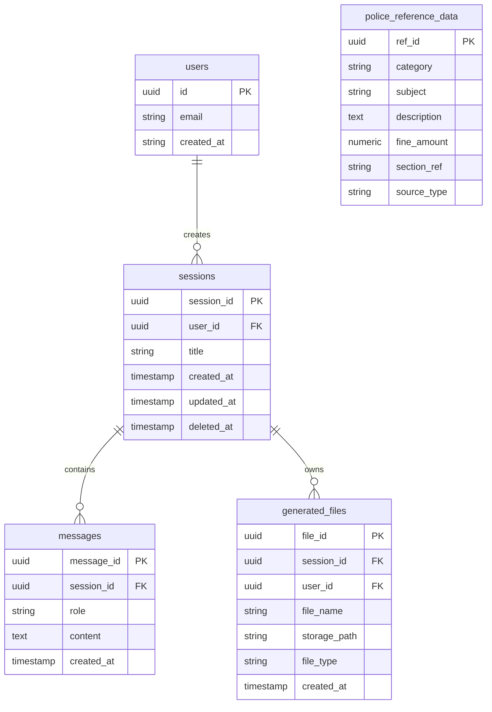

# Database Design

This document details the PostgreSQL (local/self-hosted) database schema powering the RAG Chatbot. It covers relational data only — vector embeddings live in ChromaDB (`data/chroma_db`), not Postgres. See `docs/schema-snapshot.json` for the machine-generated column/FK dump this document is checked against.

## Schema Overview

The database contains core tables responsible for managing user accounts, chat session histories, and the structured police reference data accessed by the SQL retrieval pipeline.

### Mermaid ERD

## Table Definitions

### `users`
Stores essential user identities; authenticated via JWT in an HttpOnly cookie (see `src/auth/`).
- `id`: UUID (Primary Key)
- `email`: User email address

### `sessions`
Groups a series of messages into a distinct chat thread.
- `session_id`: UUID (Primary Key)
- `user_id`: UUID linking to `users.id`
- `title`: The display name of the chat session
- `created_at`: Timestamp
- `updated_at`: Timestamp for ordering the sidebar
- `deleted_at`: Soft-delete timestamp used to hide deleted sessions.

### `messages`
The individual dialog turns (user inputs and assistant responses) within a session.
- `message_id`: UUID (Primary Key)
- `session_id`: UUID linking to `sessions.session_id`
- `role`: The speaker role (`user` or `assistant`)
- `content`: The raw text content of the message
- `created_at`: Chronological ordering timestamp

### `generated_files`
Tracks artifacts generated during a chat session (e.g. exported PDF/DOCX/XLSX files).
- `file_id`: UUID (Primary Key)
- `session_id`: The parent session where the file was generated.
- `user_id`: The owning user, for access control on download.
- `storage_path`: Where the file is stored on local disk.

### `police_reference_data`
A standalone data table for structured querying by the SQL pipeline router (Phase 3). Replaces the TaxIQ-era `tax_rates` table.
- `category`: Broad classification — `penal_code` is currently the only category with real dataset backing (`data/memory/offense_sections.csv`); `traffic_fine`, `procedure`, `contact` are reserved future values, not seeded yet.
- `subject`: The specific offense or topic (e.g. "Mobile/Vehicle Theft")
- `description`: Plain-text explanation of the offense or rule
- `fine_amount`: Numeric fine, where applicable
- `section_ref`: The PPC/PECA section reference
- `source_type`: `scraped` or `synthetic`, tracking provenance
