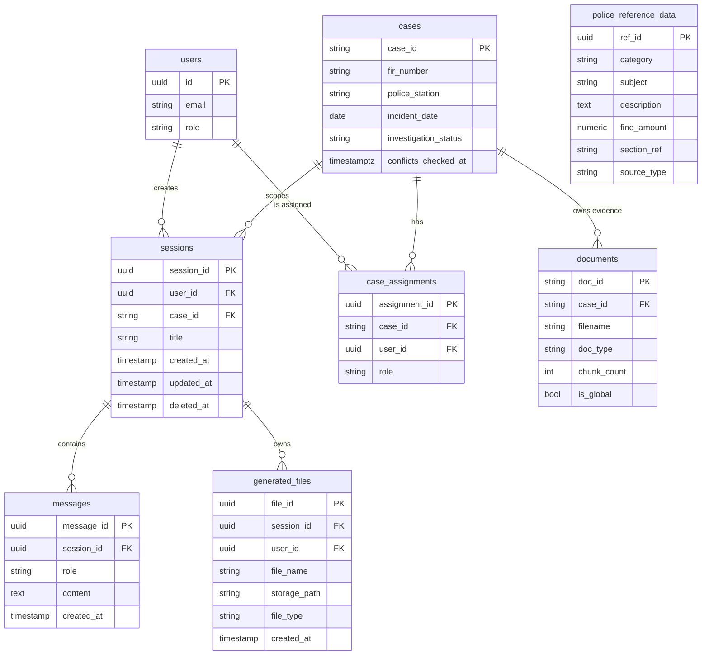

# Database Design

This document details the PostgreSQL (local/self-hosted) database schema
powering the platform. It covers relational data only — vector embeddings
live in ChromaDB (`data/chroma_db`), and the entity/relationship graph lives
in Apache AGE on this same Postgres instance (see `docs/graph_schema.md` for
that half; not duplicated here).

**M12 of the Muhafiz Data API migration** (`docs/decisions/0001-muhafiz-api-migration.md`)
rewrote this document from scratch — it previously listed 5 tables and
predated `cases`, `case_assignments`, `audit_logs`, the community-detection
tables, and RLS entirely. `docs/schema-snapshot.json` (the "machine-generated
dump this document is checked against") is **also stale** in the same way —
missing the same tables — and nothing in this migration regenerates it (no
live Postgres instance was available this session); treat it as informational
only until it's regenerated against a live database, not as the source of
truth `src/database/models.py` is.

## Schema Overview

### Mermaid ERD (core relational tables only — see prose below for the rest)

## Table definitions

### Identity & access

**`users`** — `id` (UUID PK), `email`, `password_hash`, `role`, `company_name`,
`plan`, `police_station`. Authenticated via JWT in an HttpOnly cookie (see
`src/auth/`).

**`user_context_profiles`** — one row per user, free-text conversational
context/preferences carried across sessions.

**`case_assignments`** — `assignment_id` (UUID PK), `case_id` FK → `cases`
(CASCADE), `user_id` FK → `users` (CASCADE), `role` (default
`investigator`). Not a data-ownership table — it's what
`DirectGateway.get_cases()` INNER JOINs against for any non-platform-admin
caller. **A case with no assignment row is invisible in the UI even though
the case, its documents, and its evidence all exist** — every case-provisioning
script in this migration (`scripts/sync_muhafiz_cases.py`) supports an
opt-in `--assign-to` for exactly this reason.

**`audit_logs`** — `log_id` (UUID PK), `timestamp`, `event_type`, `user_id`
FK → `users` (SET NULL), `case_id` FK → `cases` (SET NULL), `details`
(JSONB). Every graph write (`src/graph/versioning.py`) and every cross-case
graph traversal logs here.

### Cases & evidence

**`cases`** — `case_id` (Text PK, human-meaningful, e.g. `"fir-891-24"` under
this migration's "Case = FIR" decision — not a generated UUID), `fir_number`,
`crime_category`, `investigation_officer`, `police_station`, `incident_date`,
`investigation_status`, `location`, `description`, `victim_info`/`suspect_info`
(JSONB), `conflicts_checked_at` (when conflict detection last *completed* for
this case — NULL means "not known to have been checked," never "checked,
clean"; see `docs/graph_schema.md`'s `OCCURRED_ON` row and
`migrations/018_case_conflicts_checked_at.sql`). Provisioned from real FIRs by
`scripts/sync_muhafiz_cases.py`/`src/ingestion/muhafiz_cases.py` (M4 of this
migration).

**`documents`** — `doc_id` (Text PK, deterministic — see
`src/ingestion/document.py`), `user_id`, `project_id`, `case_id` FK → `cases`
(SET NULL, nullable — evidence ingested before the Case model existed, and
some shared knowledge-base uploads, have no case), `filename`, `doc_type`,
`chunk_count`, `ingested_at`, `is_global`. The relational record of a chunk
family stored in Chroma — chunk text/embeddings/retrieval metadata live there,
not here.

**`ingestion_jobs`** — per-file admin-upload progress tracking
(`POST /api/admin/kb/upload`). **Confirmed gap, not fixed by this
migration:** this table has no `case_id` column at all, and the one live
path that writes it always ingests `is_global=True` — case-scoped ingestion
(offline scripts, and `scripts/sync_muhafiz_data.py`, M9) never creates a
row here. `src/pipeline/harness/agents/data_quality.py` reports this
honestly via a caveat rather than fabricating a case-scoped count.

**`session_attachments`** — one-off chat-composer file uploads. Text
extracted once, injected into that single conversation's prompt, **never
embedded, never reaches Chroma or the graph** — structurally separate from
the knowledge-base ingestion path (`docs/INGESTION.md`).

### Reference data

**`police_reference_data`** — `ref_id` (UUID PK), `category` (`penal_code` is
the only category with real backing), `subject`, `description`, `fine_amount`,
`section_ref`, `source_document`, `source_type` (`scraped` | `synthetic`).
Two independent sources, both additive, neither replacing the other:
`scripts/seed_police_reference_data.py` (6 hand-curated rows with
descriptive text) and `scripts/load_real_offense_sections.py` (M7 of this
migration — the 36 distinct real section/act pairs measured across the live
FIR dataset, `description` left NULL since the API supplies no offense-text
per section).

### Conversation & pipeline

**`sessions`** — `session_id` (UUID PK), `user_id`, `case_id`, `title`,
`created_at`/`updated_at`/`deleted_at` (soft-delete).

**`messages`** — `message_id` (UUID PK), `session_id`, `role`
(`user`/`assistant`), `content`, `created_at`.

**`generated_files`** — exported PDF/DOCX/XLSX artifacts from a chat
session. `file_id` (UUID PK), `session_id`, `user_id` (access control on
download), `storage_path`.

**`project_memory`** / **`projects`** — project-scoped conversational memory
and project metadata, independent of the case model.

**`pipeline_runs`** / **`pipeline_steps`** — per-query orchestrator
observability (route taken, retry count, latency per stage).

**`mcp_tool_calls`** — audit trail of MCP tool invocations (the SQL route's
read-only Postgres role, `migrations/009_mcp_readonly_role.sql`).

**`error_logs`** — unhandled exception capture for the admin dashboard.

### Community detection (`migrations/016_community_detection.sql`, `017`)

**`community_runs`** — one row per Louvain community-detection run
(`run_id` PK, `computed_at`, `node_count`/`edge_count`/`community_count`,
`raw_node_count`/`raw_edge_count`). Every run **replaces** the prior one
(`DELETE FROM community_runs` before insert) — this is a "latest snapshot,"
never a versioned history, unlike the graph's own append-only discipline.

**`community_membership`** — `entity_id` (PK, canonicalized Person entity_id
post-`SAME_AS` collapse) → `community_id`, FK → `community_runs` (CASCADE).

**`community_reports`** — `community_id` (PK) → `run_id` FK (CASCADE),
`member_entity_ids`/`case_ids` (arrays), `summary_text`. No FK to
`community_membership` — both tables are replaced together in the same
detection run, so a same-transaction FK would only add an ordering
constraint without adding real safety.

### Identity index (`migrations/021_identity_index.sql`)

Graph Scale & Schema Expansion, Milestone A1 (see
`docs/decisions/0002-graph-schema-expansion-and-scale.md`) — a plain
Postgres side table backing `entity_resolution._find_by_primary_id()`/
`_generate_candidates()`'s CNIC/plate/belt_no lookup with a real
primary-key lookup, replacing what was previously an AGE
`MATCH (n:Label {id_key: $value})` — targeted-looking Cypher, but AGE has
no property index behind it, so it was a full label scan under the hood.
Not an index on AGE's own internal storage (its per-label vertex tables
are an undocumented implementation detail) — a Postgres-side table
shadowing derived/lookup state, same precedent as `community_membership`
above.

**`identity_index`** — `(label, id_key, id_value)` (composite PK) →
`entity_id`, `updated_at`. One row per identity-bearing property
`src/graph/identity_index.py`'s `IDENTITY_KEYS` tracks — `Person`/`cnic`,
`Vehicle`/`plate`, `PhoneNumber`/`phone`, and (Milestone B2)
`Officer`/`belt_no`, added to `IDENTITY_KEYS` in B2's own module rather
than deferred. A second index,
`ix_identity_index_label_key_entity (label, id_key, entity_id)`, supports
`entity_ids_excluding()` — "every entity_id this label/id_key already has
an indexed value for" — without touching `id_value`.

Maintained from one choke point, `src/graph/versioning.py`'s
`write_node()`, for every write to a tracked label — inserted/updated the
moment a node with that identity property is written. Read path: index
consulted FIRST by `entity_resolution.py`, falling back to the original
AGE scan only on a miss (defends against index/graph drift — the index
is never the sole source of truth). Both graphs share the read guard:
consulted only for `graph="evidence_graph"` (production) — an eval run
against `evidence_graph_eval` never reads or is influenced by the shared
production index.

### Persistent full-text index (`migrations/022_chunk_fulltext_index.sql`)

Graph Scale & Schema Expansion, Milestone A2 — replaces
`bm25_retriever.py`'s actual scaling cost: `retrieve_bm25()` rebuilding a
fresh `BM25Okapi` index (full tokenization + term-frequency stats) over
the entire scoped candidate pool on **every single query**. Swapping
where chunk text is read from (Chroma vs. Postgres) alone would not have
fixed this — the candidate *pool* itself had to shrink from "every chunk
in scope" to "chunks that share at least one token with the query",
which is what a real inverted index is for.

**`chunk_fulltext`** — `chunk_id` (PK, the same id Chroma stores the
chunk under), `doc_id`, a denormalized/indexed subset of scope columns
(`source`, `project_id`, `case_id`, `is_global` — the same
two-dimensional scoping `vector_store.py`'s `_build_where()` already
enforces for Chroma, applied here as a plain SQL filter), `text`,
`metadata` (JSONB, the chunk's COMPLETE Chroma metadata dict verbatim —
not just the denormalized columns, so a downstream reader like
`reranker.py`'s recency boost sees the identical shape it would have
gotten from Chroma's `get_all()`), `tsv` (GIN-indexed
`ix_chunk_fulltext_tsv`), `updated_at`. Additional btree indexes on
`project_id`/`case_id`/`source` back the scope filter.

`tsv` is built from ALREADY-TOKENIZED text
(`src/ingestion/tokenizer.py`'s Urdu-aware `tokenize()`, space-joined),
not Postgres's own `to_tsvector` tokenizing raw text — `bm25_retriever.py`
is explicit that corpus and query must share one tokenizer (Urdu
codepoint variants, script-specific punctuation); letting Postgres's
built-in tokenizer diverge from the one BM25 already depends on would
silently under/over-match Urdu content differently than the real scoring
tokenizer does. Maintained incrementally at ingest
(`src/retrieval/fulltext_index.py`'s `maintain()`/`delete_by_ids()`/
`delete_by_source()`), torn down on delete, never rebuilt from scratch
per query. `src/retrieval/fulltext_index.py::candidate_pool()` is the new
read path (`orchestrator.py`'s BM25 leg, `rag.py`, the eval scripts),
replacing `get_all_chunks()` for that one leg only — `get_all_chunks()`'s
other, unrelated uses (e.g. the FIR-number auto-scope metadata scan) are
untouched.

### Pending-candidate priority (`migrations/027_pending_candidate_priority.sql`)

Graph Scale & Schema Expansion, Milestone D1 (see
`docs/decisions/0002-graph-schema-expansion-and-scale.md`) — a Postgres
side table shadowing every currently-PENDING `SAME_AS`/`CITES` edge in
AGE, same design discipline as `community_membership` above and A1's
`identity_index`: never the source of truth, always traceable back to a
real edge in AGE by `edge_id`.

**`pending_candidate_priority`** — `edge_id` (PK, the AGE edge's own
internal id), `edge_label` (`SAME_AS`/`CITES`), `tier`, `a_key`/`b_key`
(entity_id or case_id, whichever the edge connects), the write-time
scoring snapshot (`original_confidence`/`original_basis`/
`original_name_similarity`/`original_shared_case`/
`original_shared_structured_id`), and the re-scoring-owned columns
`priority_score`/`why`/`group_id`/`deprioritized`/`last_scored_at`.

Maintained from one choke point — `src/graph/versioning.py`'s
`write_edge()` — mirroring exactly how `identity_index` is maintained
from `write_node()`: a row is inserted the moment a pending edge is
written, and deleted the moment a human confirms/rejects it (never
mutated to reflect a status change — status changes are what deletes the
row). The re-scoring columns are written exclusively by
`src/graph/candidate_reprioritization.py`, which never calls
`write_edge()` — structurally incapable of confirming/rejecting a match.

## Row-Level Security

`migrations/008_rls_policies.sql`/`010` arm RLS on `documents`/`sessions`/
`cases`/`messages`, gated through `src/database/postgres.py`'s
`current_rls_active`/`current_cross_case` session variables. Apache AGE has
**no native RLS equivalent** — the graph's own case-isolation story
(`src/graph/case_scope.py`) is a structural chokepoint, not a database-level
guarantee; see `docs/graph_schema.md`'s "Case isolation for the graph" section
for the full, honestly-stated distinction.
