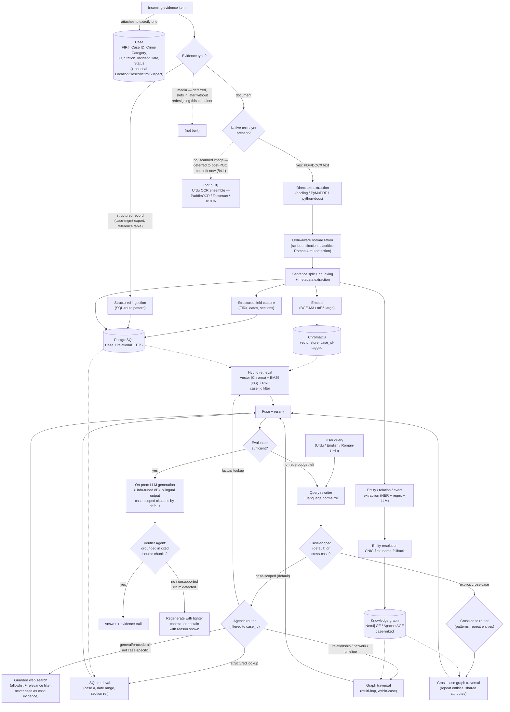
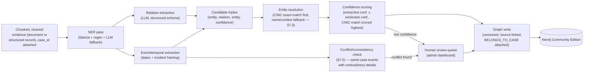
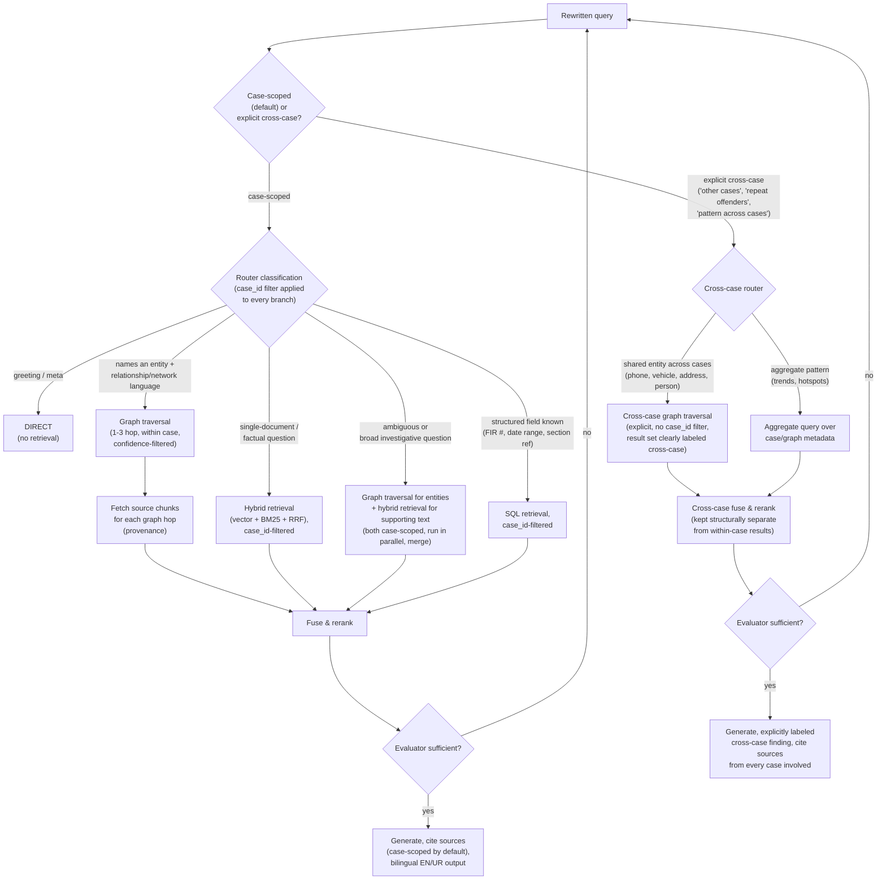
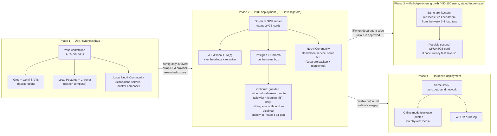

# Muhafiz — Evidence Intelligence Platform: Architecture Report

*Client-facing product name per the SOW: **Evidence Intelligence Engine (EIE)**. This report keeps "Muhafiz" as the primary title for continuity with the existing codebase and the companion synthetic dataset plan — see §15 for the full reconciliation against the SOW.*

**From reference-lookup assistant to Urdu-first evidence intelligence platform.** A grounded, testable architecture for case-centric reasoning, entity/relationship analysis, and operational decision support over Urdu police evidence — built to run on one GPU today and scale to a real deployment without a rewrite.

| | |
|---|---|
| **Prepared** | 20 July 2026 |
| **Revised** | 21 July 2026 — client-directed finalization pass: OCR deferred to post-POC, Verifier Agent added as a current-phase priority, Policy Agent scoped as future exploration, guarded web search designed, Elasticsearch/OpenSearch and a specialized multi-agent path added as evaluated alternatives (§15.4 has the full changelog) |
| **Scope** | Case-centric evidence platform, Islamabad Police — POC scale now, single-department pilot as the near-term growth case |
| **Team** | Solo builder, strong ML/infra background |
| **Hardware** | 1× 24GB-class GPU (3090/4090 tier) |
| **Status** | Pre-build — decisions pending A/B benchmarking; scope finalized against direct client feedback (§15.4), still pending final client confirmation on remaining open items (§15.3) |

This is a decision record, not a finished implementation. Every shortlisted component is meant to be benchmarked against your own synthetic (then real) data before being locked in. The SOW states explicitly that it reflects the full long-term product vision and that POC scope will be finalized separately — this report is written against that full vision, with POC-vs-later-phase priority flagged wherever it matters (see §15).

---

## Contents

1. [Executive summary & key calls](#1-executive-summary--key-calls)
2. [Context, assumptions & what would change this](#2-context-assumptions--what-would-change-this)
3. [Recommended architecture overview](#3-recommended-architecture-overview)
4. [Urdu NLP pipeline](#4-urdu-nlp-pipeline)
5. [Urdu embedding models](#5-urdu-embedding-models)
6. [GraphRAG: the case for and against](#6-graphrag-the-case-for-and-against)
7. [Intelligence knowledge graph design](#7-intelligence-knowledge-graph-design)
8. [Retrieval architecture & agentic routing](#8-retrieval-architecture--agentic-routing)
9. [Urdu-capable LLM shortlist](#9-urdu-capable-llm-shortlist)
10. [Security architecture](#10-security-architecture)
11. [Deployment architecture & hardware](#11-deployment-architecture--hardware)
12. [Synthetic dataset & evaluation plan](#12-synthetic-dataset--evaluation-plan)
13. [Phased implementation roadmap](#13-phased-implementation-roadmap)
14. [Risks, trade-offs & future work](#14-risks-trade-offs--future-work)
15. [SOW reconciliation](#15-sow-reconciliation)

---

## 1. Executive summary & key calls

The existing Muhafiz codebase is a solid, well-tested skeleton — orchestrator, hybrid retrieval, RRF, admin dashboard, observability — but it is currently an **English-oriented reference-lookup assistant built on cloud APIs** (Groq LLaMA 3.3 70B, Gemini) over a single shared document pool. None of that is wrong for what it was built for; none of it is sufficient for an Urdu-first, on-prem, case-centric evidence intelligence platform. This report treats the pivot honestly: what carries over (orchestrator shape, RRF, Postgres/Chroma split, admin observability), and what has to be added or replaced (Urdu NLP stack, on-prem model serving, a knowledge graph, real RBAC/ABAC and audit, entity resolution, and — as of this revision — a Case as the first-class unit everything else attaches to).

**Case is the organizing unit, not a metadata tag.** The client SOW makes an investigation ("Case") a first-class object — FIR Number, Case ID, Crime Category, Investigation Officer, Police Station, Incident Date, Investigation Status, plus optional Location/Description/Victim/Suspect details — that all evidence, all retrieval, and all AI-generated output attach to and scope by default. Every document/evidence item belongs to exactly one Case. Most real queries will be "within this case"; cross-case queries (repeat offenders, shared entities, pattern analysis across the evidence repository) are an explicit, separately-designed second mode, not the default. §3, §7, and §8 all restructure around this.

**Build a graph, don't skip it.** Officers explicitly need cross-case entity linkage and network/timeline reasoning — the queries that hybrid vector+keyword search structurally cannot answer well. §6 makes the case in both directions; the graph wins here on the stated query patterns, not by default. Case-scoping doesn't weaken this case — it just means the graph now serves two distinct, well-defined query shapes (within-case traversal as the common case, cross-case pattern-matching as the intelligence-analysis case) instead of one.

**CNIC first, name second — entity resolution now has a formal priority order.** Where a CNIC (or equivalent unique government ID) is present in the evidence, it is the primary resolution key: same CNIC merges with high confidence, different CNICs never merge regardless of name similarity. Name-based fuzzy matching is the fallback for the — likely common — case where evidence doesn't carry a CNIC, but it never reaches auto-merge confidence on its own. §7.3 details the confidence-tier rework this drives.

**Cloud during dev, hard cutover before real data.** Keep Groq/Gemini for synthetic-data prototyping — it's faster to iterate on pipeline logic than fighting local inference from day one. The architecture is designed so that cutover is a config change, not a rewrite: every LLM call already goes through one provider abstraction.

**24GB comfortably covers the actual near-term scale.** The SOW frames the initial deployment as roughly 1-5 investigators, not the 50-100-user pilot this report originally sized for — see §2 and §11. An 8B Urdu-tuned LLM (Q4/Q8) + BGE-M3 embeddings + a small reranker fit concurrently on one 24GB card via vLLM with real headroom to spare at that scale; the 50-100-user case is retained in this report as the stated future full-department growth target, not the number driving near-term hardware decisions.

**OCR is deferred to post-POC — decided, not just flagged.** Mostly computerized Urdu/English PDFs and DOCX are expected, with scanned and handwritten as the minority. Per direct client instruction, OCR moves out of the POC build entirely and lands in a later phase, matching the SOW's own Phase 3/tentative framing (§4.1, §13). The POC document pipeline handles native-text PDF/DOCX only; scanned and handwritten evidence is excluded from the POC demo corpus rather than silently unsupported forever — the shortlist in §4.1 is retained as a forward reference for when that phase starts.

**Evidence is now a typed container, not "always document text."** The SOW names documents, media, and structured records as evidence sources. This revision scopes structured records (case-management-system exports, reference tables) in now, alongside the existing document pipeline, and explicitly defers media (audio/video/image evidence) and OCR — while designing the evidence-type abstraction so both slot in later without redesigning the Case/evidence data model. §3.2 and §15 cover this.

**Grounding gets a dedicated agent, not just a prompt instruction.** Per client direction, a **Verifier Agent** is a current-phase priority: a discrete step between generation and response delivery that checks every claim in a generated answer against its cited source chunks, and blocks or flags ungrounded, generic, or off-topic output before it reaches the investigator. §8's Verifier Agent subsection and §10.1 cover the design; this is the direct answer to "implement safeguards against hallucinations, generic responses, and off-topic outputs."

**Policy Agent is scoped as future work, not built now.** The client asked to *explore* a Policy Agent for future RBAC support while prioritizing the Verifier Agent now — this revision keeps that distinction sharp: RBAC/ABAC stays rule-based in §10 for the POC, and §10.2 sketches the Policy Agent as a documented future direction rather than a POC deliverable.

**Web search gets explicit guardrails, not a silent carry-over.** The current Muhafiz router already has a WEB fallback route; this revision defines guardrails around it — domain allowlisting, relevance/safety filtering, and a hard rule that web results are never cited as case evidence — so officers can use it for general/procedural lookups without it becoming a hallucination or evidence-integrity risk. See §8's web search subsection.

**Retrieval-backend and agent-architecture alternatives are now evaluated, not silent gaps.** This revision adds an explicit Elasticsearch/OpenSearch evaluation against the current Postgres `tsvector` approach, and a documented (future-phase) path toward splitting the single orchestrator into specialized agents — evidence analysis, timeline reconstruction, entity matching — referencing NVIDIA's RAG Blueprint as a production-RAG design pattern worth benchmarking against. See §8's new subsections.

### The decisions that matter most

| Decision | Call | Why |
|---|---|---|
| Data model | **Case is a first-class entity.** Every evidence item carries a `case_id` FK; retrieval, graph traversal, and generation are case-scoped by default, with cross-case as an explicit second mode | Matches the SOW's Phase 1 directly; also the only way "case summarization," "case-scoped semantic search," and "cross-case pattern analysis" (SOW Modules 3, 4, 7) can coexist without one silently leaking into the other |
| Graph or no graph | Build one, on **Neo4j Community Edition** as primary (Apache AGE remains a documented alternative for teams confident they'll never scale past a single box) | Query patterns (network/timeline, cross-case linkage) are exactly the graph-favoring case; the project is expected to scale past the initial POC, and Neo4j's native traversal engine avoids a costly migration once multi-hop query volume grows past what AGE's Postgres-emulated planner handles well |
| Entity resolution | **CNIC-first, name-fallback.** CNIC match → auto-merge; strong name+context without CNIC → flagged-unverified at most; weak name-only match → human review | Directly addresses the real, common risk of multiple different people sharing the same or similar name — a core test case, not an edge case, per Change 4 of this revision |
| Embeddings | Benchmark BGE-M3 vs multilingual-e5-large-instruct on your own synthetic set before locking | Both are MIT-licensed, Urdu-covering, and run comfortably on 24GB; no single "obviously correct" winner exists for Urdu specifically — this is a real A/B, not a formality |
| Generation LLM | Urdu-specialized 8B (Alif-1.0 or Qalb) for the answer-writing role; a general-purpose instruction model (Qwen2.5/3-Instruct) for routing/tool-use/reasoning | Urdu fluency and JSON-reliable tool-calling are different skills; the current single-model-does-everything pattern in Muhafiz won't hold for Urdu quality |
| OCR | **Deferred to post-POC (Phase 3+), per client decision.** PaddleOCR PP-OCRv4 primary, Tesseract as cross-check, TrOCR reserved for the Nastaliq/handwritten minority — shortlist retained as a forward reference, not built now | Matches the SOW's own later-stage framing directly; POC ingestion handles native-text PDF/DOCX only, scanned/handwritten evidence excluded from the POC demo corpus |
| Answer grounding | **Verifier Agent**, current-phase priority — a post-generation check that every claim traces to a cited source chunk; blocks or flags ungrounded/generic/off-topic output | Client-prioritized directly; citation discipline elsewhere in this report produces citations but nothing previously checked that generated prose actually stayed inside them (§8, §10.1) |
| Access-control architecture | RBAC/ABAC (§10) stays rule-based and built now; a **Policy Agent** — one queryable service centralizing access decisions — is scoped as future-phase exploration only | Client asked to *explore* this for future RBAC support, distinct from building it now (§10.2) |
| Web search | Existing WEB router branch kept, now with explicit guardrails: domain allowlist, relevance/safety filtering, never cited as case evidence | Lets officers do general/procedural lookups without risking an unvetted web result being mistaken for case-grounded fact (§8) |
| Keyword-search backend | Stay on Postgres `tsvector` for the POC; Elasticsearch/OpenSearch evaluated and documented as the upgrade path if Urdu analyzer quality or scale demands it | Migrating now is unjustified at POC scale/timeline; the evaluation is written down so it isn't re-litigated from scratch later (§8) |
| Deployment | Cloud APIs through synthetic-data development; single on-prem GPU box, air-gap-capable, before real data | Matches the stated on-premises/data-sovereignty constraint directly — this is not negotiable once real case evidence is involved |

> **Honest timeline flag.** A 3-month pilot target is realistic for a synthetic-data MVP with hybrid retrieval, the case-centric data model, and on-prem cutover. It is **tight** for also shipping a fully entity-resolved, versioned knowledge graph in the same window. §13 gives a 12-week core track that lands a working, demoable POC, with the graph as an explicit week 9–16 extension rather than a day-one dependency.

---

## 2. Context, assumptions & what would change this

Everything below was locked in through clarifying questions before any research happened, then revised where the client SOW (read in full for this revision — see §15) changed the picture. Treat this table as the load-bearing assumptions of the whole report — if any row changes, the affected sections are named so you know what to revisit.

| Assumption | As stated | Revisit if this changes |
|---|---|---|
| Team | Solo/1-2 people, strong ML+infra background | Everything — a larger team changes the calculus on managed vs. self-hosted for Postgres/graph/vector stores (§10, §11) |
| GPU | One 24GB-class card (RTX 3090/4090 tier), already owned | §9 (LLM sizing), §11 (hardware/concurrency budget) — a second GPU or A100-class card changes the model-size ceiling materially |
| Timeline | Fast pilot, ~3 months, one station, real data arrives later | §13 roadmap sequencing and what's "in scope for POC v1" |
| **Deployment scale** *(revised)* | **~1-5 investigators at the POC/initial-deployment stage** (per the SOW's own framing), with **~50-100 users as the stated future full-department growth case**, not the near-term design target | §11 hardware sizing now leads with the 1-5 figure; §6/§9's "expected to scale" framing is about future document/query *volume*, not this immediate user-count change — that reasoning is unaffected |
| Case as organizing unit *(new)* | Every evidence item belongs to exactly one Case (FIR Number, Case ID, Crime Category, Investigation Officer, Police Station, Incident Date, Investigation Status, + optional Location/Description/Victim/Suspect info), per the SOW's Phase 1 | §3 (data model), §7 (graph schema), §8 (retrieval scoping) — this is the single biggest structural change in this revision |
| Evidence types in scope *(revised)* | Documents (Urdu NLP pipeline over **native-text PDF/DOCX only**) and structured records (SQL-route pattern) are in scope now; **OCR/scanned-handwritten documents** (moved this revision, client decision), audio, video, and image-evidence analysis are all explicitly deferred | §3.2 (evidence-type container), §4.1 (OCR deferral), §15 (extensibility check for when media/OCR are added later) |
| POC scope vs. full vision | The SOW explicitly states it reflects the **full long-term product vision** and that POC scope will be finalized separately between both teams | §15 — this report is written against the full vision with POC-priority flags throughout, not against a locked POC scope that doesn't exist yet |
| Real sample data | None yet — fully synthetic until customer handoff | §12 (synthetic dataset plan) is the load-bearing eval strategy until this changes; §15 notes the case-centric model is a follow-up item for that document, not yet applied to it |
| Real document format (expected) | Majority computerized PDF/DOCX, Urdu+English+Roman-Urdu mixed; some scanned; handwritten rare | §4 (OCR tier prioritization), §12 (synthetic data realism target) |
| Query patterns | Document/case lookup *and* cross-case entity relationships *and* network/timeline reasoning *and* within-evidence inconsistency flagging — confirmed query patterns per SOW Module 7, not aspirational | §6 GraphRAG decision, §7.5 (new conflict-detection design) |
| Network posture | Air-gapped in real deployment (matches the SOW's on-premises/data-sovereignty note directly); internet/cloud APIs acceptable for dev and MVP testing at your end | §10 (security), §11 (deployment topology) — the two-phase design exists specifically because of this row |
| Interface language | Bilingual English/Urdu, including AI-generated responses and reports, with a language-selection option (SOW Platform Notes) | §8 (bilingual output design note) — this is an output-language requirement, not just an input-language one |

---

## 3. Recommended architecture overview

The shape below keeps everything from current Muhafiz that already works — the orchestrator loop, hybrid retrieval, RRF, the admin/observability layer, the data-gateway abstraction — and adds four new subsystems: a **Case as the first-class organizing entity**, a typed **evidence container** (document vs. structured record), an Urdu-aware ingestion pipeline, a property graph fed from the same ingestion pass, and on-prem model serving that the router can call instead of Groq/Gemini once the cutover happens.

**Figure 1** — end-to-end shape. The left half is ingestion (extends `src/ingestion/`); the right half is the retrieval/routing loop (extends `src/pipeline/orchestrator.py`). Everything already in Muhafiz is in the "Hybrid retrieval" and "Fuse + rerank" boxes; the Case entity, evidence-type container, graph, on-prem generation, Urdu-aware cleaning, guarded web search, and the Verifier Agent are the new/revised subsystems. OCR is drawn dotted/deferred, matching the treatment already used for the deferred `MEDIA` evidence type — it's designed for, not built now.

### 3.1 Case as the organizing unit

Per the SOW's Phase 1, a Case is created before any evidence exists for it, with these fields:

| Field | Required? | Notes |
|---|---|---|
| FIR Number | Required | Human-facing case identifier; not assumed globally unique across stations, so it's not the primary key |
| Case ID | Required | System-generated primary key; what every evidence item's foreign key actually points to |
| Crime Category | Required | Drives which `offense_sections`-style structured reference data applies (existing SQL-route pattern) |
| Investigation Officer | Required | Also the natural anchor for RBAC/ABAC case-assignment scoping (§10) |
| Police Station | Required | |
| Incident Date | Required | Distinct from evidence ingestion date — timeline reconstruction (§7) needs both |
| Investigation Status | Required | Drives whether a case is "open" for new evidence/queries or effectively archived |
| Location | Optional | Free text now; a natural future GIS-mapping attachment point (§15) |
| Initial Case Description | Optional | Short free text, embedded and indexed like any other evidence-adjacent text |
| Victim Information | Optional | Structured sub-fields where known; treated as Person entities in the graph (§7.1), not a separate schema |
| Suspect Information | Optional | Same treatment as Victim Information |

**Every document/evidence item belongs to exactly one Case** — a `case_id` foreign key, not a metadata tag applied after ingestion. This is enforced at write time (an evidence item can't be ingested without a case) and is the first-class filter dimension for every retrieval mode: vector search, keyword search, SQL lookup, and graph traversal all accept `case_id` as a query parameter, not a post-hoc filter on results that were already ranked without it (the same "filter before ranking, never after" principle the security design in §10 already applies to document-level permissions).

### 3.2 Evidence types: documents and structured records (media deferred)

The SOW names three evidence sources — documents, media, and structured records — and notes the exact types/formats are still being scoped. This revision treats **evidence as a typed container** rather than assuming everything is document text:

| Evidence type | Status | Ingestion path |
|---|---|---|
| Document, native-text (PDF/DOCX) | **In scope now** | The Urdu NLP pipeline in §4 — normalization, chunking, entity extraction. OCR is not part of the POC path (see below) |
| Document, scanned/handwritten (OCR-dependent) | **Deferred to post-POC**, client decision this revision | Not built now. §4.1 keeps the PaddleOCR/Tesseract/TrOCR shortlist as a forward reference; wiring it in is additive to this same typed container, not a redesign |
| Structured record (case-management-system export, reference table row) | **In scope now, added by this revision** | Closer to the existing SQL-route pattern than the document pipeline — arrives as typed rows/fields, written directly into Postgres with structured-field extraction rather than chunked/embedded free text. For reference data specifically (like the `police_reference_data` table driving the SQL routing), records are explicitly **case-agnostic** (loaded globally rather than per-case), providing domain context to all cases uniformly. Case-specific structured evidence gets a `case_id` FK, but both participate in entity extraction over their text-bearing fields while skipping chunking entirely |
| Media (audio, video, images beyond text) | **Explicitly deferred** | Not built. The evidence-type abstraction is designed so a future `MediaEvidence` type can be added as a third typed container sharing the same `case_id` FK and the same downstream entity-extraction/graph-write path, without restructuring the Case/evidence relationship itself — see §15 for the specific extensibility check |

### What stays, what's added, what's replaced

| Layer | Current Muhafiz | Evidence Intelligence Platform | Verdict |
|---|---|---|---|
| Data model | Flat corpus, no case concept | **Case as first-class entity**; every evidence item FK'd to exactly one case | New subsystem |
| Evidence-type handling | Everything assumed to be document text | Typed container: document vs. structured record now, media deferred but designed for | New subsystem |
| Orchestration | Rewrite → Route → Retrieve → Rerank → Evaluate → Generate, SSE-streamed | Same loop, with case-scope resolved before routing and a 6th route (cross-case) alongside graph | Keep, extend |
| Response/report generation | Single shared corpus context | **Case-scoped by default** — citations and generated reports draw from the current case; cross-case findings are surfaced as an explicit, distinctly-labeled second mode, never blended silently into a case-scoped answer | Adapt |
| Relational store | Postgres, direct SQL via DataGateway | Same, plus the Case table, row-level security policies, and an audit-log table | Keep, harden |
| Vector store | ChromaDB, 384-dim generic embeddings | ChromaDB retained; embeddings swapped to a benchmarked Urdu-capable model; every chunk carries `case_id` metadata | Keep engine, swap model, extend metadata |
| Keyword search | Postgres `tsvector` + in-process BM25 | Same, with an Urdu-aware analyzer/stemmer instead of the English default, `case_id`-filterable | Adapt |
| LLM inference | Groq + Gemini, cloud-only | Cloud for dev; vLLM-served local models before real data; bilingual (EN/UR) output | Replace for prod |
| Ingestion loaders | docling/PyMuPDF/pandas/BS4/python-docx, Gemini Vision for images | Same loaders + Urdu OCR ensemble + normalization stage + entity/relation extraction, all case-scoped | Extend |
| Knowledge graph | None | New: Neo4j Community Edition (primary) — Apache AGE documented as the single-box alternative; every entity/relationship case-linked, cross-case traversal an explicit second mode | New subsystem |
| Entity resolution | None | CNIC-first, name-fallback confidence tiering (§7.3) | New subsystem |
| Access control | JWT + `is_admin` boolean | RBAC (role) + ABAC (case/unit scoping, now anchored to the real Case entity's Investigation Officer field) + document-level and row-level permissions | Replace |
| Admin/observability | Full dashboard: latency, errors, ingestion status, per-step trace | Same, plus audit log viewer (chain-of-custody framing) and entity-resolution review queue | Keep, extend |

---

## 4. Urdu NLP pipeline

The single most important framing here: because most real documents will be computerized text, not scanned images, OCR is not the pipeline's critical path for the pilot — it's a well-scoped subsystem for a minority of documents. Don't let it consume disproportionate build time relative to normalization, chunking, and entity extraction, which touch *every* document. All of it now operates within the Case/evidence-type model from §3 — every document arrives already attached to a Case before this pipeline runs.

### 4.1 OCR — deferred to post-POC

> **Resolved this revision: OCR is out of the POC build.** The SOW lists OCR under Phase 3 ("Automated Evidence Processing") and marks it explicitly *tentative* and *at a later product stage*; the client has since confirmed directly that OCR should stay outside current POC scope. This section is kept as a forward reference — the shortlist below is what gets built when OCR is scheduled, not a POC deliverable. The POC document pipeline (§3.2, §4.2) runs on native-text PDF/DOCX only; scanned and handwritten evidence is excluded from the POC demo corpus rather than silently unsupported.

| Tool | Role | License | Why / when |
|---|---|---|---|
| **PaddleOCR (PP-OCRv4/v5)** — Primary | Printed/typed scanned pages — the bulk of the "some scanned" slice | Apache 2.0 (OSI) | Best independently-benchmarked accuracy on Urdu-script text among mainstream open OCR engines; lightweight and server variants both available, so it fits on the same GPU as everything else or falls back to CPU |
| **Tesseract** (`urd` traineddata) — Cross-check | Second opinion / ensemble voting on low-confidence PaddleOCR output; zero-GPU fallback | Apache 2.0 (OSI) | Weakest raw accuracy of the three in independent benchmarks, but ubiquitous, well-understood failure modes, and useful purely as a disagreement signal to flag pages for human review |
| **TrOCR** (transformer OCR, Urdu/Nastaliq fine-tuned) — Hard cases | Nastaliq calligraphic print and the rare handwritten documents | MIT (base) | Best published performance specifically on Nastaliq among tested models, though error rates there remain materially higher than printed Naskh-style text — treat its output as a first pass for human review, not an autonomous transcription |
| UTRNet — Watch, don't build on | Research reference for Nastaliq-specific benchmarking | Research/academic release | Purpose-built for Urdu but shows brittleness across script/domain shifts in independent evaluation; useful as a benchmark comparison point, not recommended as the production primary yet |

> **What would make you switch:** if, once real documents arrive, handwritten daily-diary and witness-statement volume turns out to be much higher than "rare," re-open this decision: it would justify investing in a fine-tuned TrOCR/UTRNet model on an in-domain labeled set rather than treating handwriting as an edge case with human review as the safety net.

### 4.2 Normalization, tokenization, sentence splitting

| Stage | Primary | Alternative | Notes |
|---|---|---|---|
| Character/diacritic normalization | `urduhack` | Custom regex normalizer using CLE/CRULP character-mapping tables | `urduhack`'s documented Python support (3.6/3.7) predates your stack (3.11+) — verify compatibility or re-vendor its normalization rules directly before depending on it; it's the kind of quiet unmaintained-dependency risk that's easy to miss |
| Word tokenization | `urduhack` tokenizer | Stanza (Urdu UD model) | Stanza is actively maintained by Stanford NLP and includes tokenizer + POS + lemmatizer + NER trained on the Universal Dependencies Urdu treebank — heavier dependency, but a safer long-term bet than a stalled library |
| Sentence splitting | Stanza sentence segmenter | Rule-based (Urdu sentence-final punctuation: ۔ ؟ !) | Urdu's sentence-final mark (۔, U+06D4) is not ASCII period — any English-tuned splitter (including naive regex ported from English) will silently under-split Urdu text; test this explicitly against synthetic data |
| Chunking | Keep current size/overlap chunker, tuned per-language | Semantic/recursive chunking respecting sentence boundaries | Chunk boundaries should never split mid-sentence for Urdu the way character-count chunking on English tolerates; use the sentence splitter's output as chunk boundaries, not raw character offsets |

> **Roman-Urdu is a real, separate risk — not covered by "multilingual."** Roman-Urdu (Urdu written in Latin script, common in informal notes and some digital records) is not a standard language code that multilingual embedding/NLP models are meaningfully trained on. Standard language-ID tools will often misclassify it as English, Malay, or Indonesian. Don't assume BGE-M3/multilingual-e5 "handle" Roman-Urdu just because they handle 100+ languages — **this needs an explicit slice in the synthetic eval set (§12)** to find out empirically whether raw embedding retrieval on Roman-Urdu text is usable, or whether a transliteration-to-Urdu-script normalization step is required before embedding. Budget for the possibility that this needs a small in-house rule-based or statistical transliterator; don't discover it during the real-data cutover.

### 4.3 Metadata extraction, cleaning, entity extraction

| Task | Approach | Why this split |
|---|---|---|
| Structured entities: phone numbers, CNIC numbers, vehicle registration plates, FIR/case numbers, dates | Deterministic regex + format validators, **never** LLM-extracted | These have fixed, learnable formats. Regex gives 100% precision on well-formed instances and is auditable; an LLM will occasionally hallucinate or mis-transcribe a digit, which is unacceptable for a case number *or a CNIC now that CNIC is the primary entity-resolution key (§7.3) — a mis-transcribed digit here doesn't just corrupt one field, it silently breaks resolution* |
| Generic named entities: person, location, organization | Stanza Urdu NER (fast first pass) with LLM fallback on low-confidence spans | Stanza is cheap and fast for the common case; escalate to LLM only where the statistical tagger is uncertain, to control inference cost at POC scale |
| Domain-specific entities: vehicle, weapon, gang/organization alias, informal role ("witness," "complainant") | Few-shot LLM extraction with a fixed structured-output schema | No pretrained Urdu NER model covers these police-specific types — there is no realistic off-the-shelf shortcut here; this is inherently an LLM-extraction problem until you have enough labeled data to fine-tune a dedicated tagger |
| Document-level metadata: document type (FIR/diary/challan/statement), date, station, source, **owning case** | LLM classification pass + regex validation of extracted dates; `case_id` comes from the ingestion-time attachment in §3.1, never inferred from content | Document type classification benefits from LLM context understanding; dates get regex-validated afterward since malformed dates break downstream timeline reasoning silently; case ownership must never be inferred from text, since a wrong inference here would leak evidence across cases |

---

## 5. Urdu embedding models

No single embedding model has a strong, Urdu-specific, independently-verified track record the way English retrieval does — this section is a benchmarking plan as much as a shortlist. Test all three against the synthetic eval set in §12 before locking one in for the corpus you'll actually re-embed everything against. Nothing about the Case-centric revision changes this section — embeddings are the same regardless of which case a chunk belongs to; `case_id` is metadata attached alongside the vector, not a modeling concern.

| Model | Dim | License | VRAM (fp16) | Notes |
|---|---|---|---|---|
| **BGE-M3** — Primary | 1024 | MIT (OSI) | ~2.3GB | Dense + sparse + multi-vector (ColBERT-style) in one model; explicitly trained for 100+ languages including South Asian scripts; best documented quality-cost ratio among fully open, commercially-unrestricted multilingual embedders |
| **multilingual-e5-large-instruct** — Alt | 1024 | MIT (OSI) | ~2.2GB | Instruction-tunable (task prefixes improve retrieval quality), strong general multilingual MTEB results; worth A/B'ing against BGE-M3 specifically because instruction-prefixing sometimes measurably helps asymmetric query→document retrieval, which is most of what officers will do |
| jina-embeddings-v3 | 1024 (Matryoshka, truncatable) | **CC BY-NC 4.0 — source-available, non-commercial** | ~1.1GB | **Flag explicitly:** non-commercial license for self-hosted weights — production self-hosting for a government platform requires a commercial license from Jina, or use their API (which contradicts the on-prem constraint). Include only if you've confirmed licensing terms with Jina; otherwise it's disqualified before benchmarking even starts |
| LaBSE (reference baseline) | 768 | Apache 2.0 (OSI) | ~1.8GB | Older (2020) but a solid, well-understood cross-lingual baseline (covers Urdu); useful as a sanity-check floor to confirm BGE-M3/mE5 are actually beating a known quantity, not just beating each other |

### What to actually measure

| Axis | Method |
|---|---|
| Retrieval quality | Recall@5/10 and MRR against the 100-200 query synthetic eval set (§12), split by language (Urdu / English / Roman-Urdu) so a strong blended score can't hide a Roman-Urdu failure |
| Inference speed | Embeddings/sec on the target GPU, batch size matched to expected ingestion throughput |
| GPU footprint under concurrent load | Measure with the LLM and reranker loaded simultaneously via vLLM — the number that matters is total VRAM headroom left on a 24GB card, not the embedding model in isolation |
| Deployment complexity | BGE-M3 and mE5 both load via `sentence-transformers` with no special serving infra; this is a wash between the two finalists — don't let it be a tiebreaker on its own |

> **Where testing alternatives would *not* be worth the time:** don't spend cycles benchmarking English-only embedding models (OpenAI ada/text-3, English-only sentence-transformers) — they have no Urdu training exposure and will fail silently (return plausible-looking but wrong nearest neighbors) rather than obviously. The current Muhafiz 384-dim local model falls in this category and should be assumed disqualified for Urdu without needing to prove it empirically first.

---

## 6. GraphRAG: the case for and against

This is the decision the user explicitly asked not to be assumed. Here is the case both ways, resolved by the stated query patterns — not by GraphRAG being fashionable.

### The case against a graph

- Entity resolution is genuinely hard and easy to get quietly wrong — a merged "Muhammad Ali" that's actually two different people poisons every downstream query silently
- Build + maintenance cost is real and ongoing: extraction pipeline, resolution logic, graph schema evolution, a second query language (Cypher/openCypher) to operate and debug
- At POC/pilot scale, hybrid vector+BM25+SQL retrieval alone already answers most factual and even many relational within-case questions reasonably well via good chunking and metadata filtering
- A solo builder on a 3-month clock is exactly the profile most likely to under-invest in entity resolution QA, which is where graphs quietly fail

### The case for a graph

- The confirmed query patterns are the textbook graph-favoring case: *"has this phone number appeared in other cases," "who else is linked to this address/vehicle," "map this person's known associates," "timeline of incidents involving this group,"* plus SOW Module 7's explicit ask for cross-case pattern analysis and within-case inconsistency flagging (§7.5)
- These are **multi-hop** and **cross-document** by nature — hybrid RAG retrieves chunks ranked by relevance to a query, but has no native concept of "traverse from entity A through two relationship hops to entity C." Approximating this with retrieval alone means either massively over-retrieving or missing the connection entirely
- Investigative work is *inherently* about repeated entities across documents (repeat offenders, shared addresses, shared vehicles) — this is not a niche use case for police data, it's close to the core value proposition of "intelligence" as opposed to "search"
- Scale is favorable: a single department's case volume is well within what a single-node Apache AGE or Neo4j Community instance handles comfortably — the "graphs don't scale" concern is an argument against graphs at hundreds of millions of nodes, not here

> **Verdict:** build the graph. The deciding factor is that "network/timeline reasoning" and "cross-case entity relationships" were confirmed as real, expected query patterns — not aspirational nice-to-haves. Where the against-case wins is in *how much confidence to place in it*: treat entity resolution as its own workstream with its own evaluation harness (§7.3), not a side effect of extraction, and be willing to ship the graph as a lower-confidence, clearly-labeled "related entities" surface in v1 rather than blending unresolved graph output silently into generated answers.

> **Case-scoping doesn't weaken this case — it clarifies it.** With Case as the organizing unit (§3.1), the graph now serves two distinct, well-defined query shapes instead of one blended pool: **within-case traversal** (the default — "who is connected to whom in this investigation") and **explicit cross-case pattern-matching** (the SOW's Module 7 ask — repeat entities, shared attributes, patterns across the evidence repository). Both need the same underlying graph; they differ only in whether the traversal query includes a `case_id` filter. See §7.1 and §8 for the mechanics.

> **Database choice: Neo4j Community, not Apache AGE.** This project is explicitly expected to scale beyond the initial POC — larger future document/case volume and deeper, higher-frequency multi-hop traversal (associates-of-associates, cross-case network queries) is where AGE's reported weak spot — its Postgres-emulated query planner losing ground to native graph engines on deep multi-hop traversal as scale grows — is most likely to become a real bottleneck, not a theoretical one. Choosing Neo4j now avoids a costly mid-scale migration later: re-running the extraction pipeline's graph-write step, re-pointing the router's graph branch, and rebuilding the access-control model against a different query engine, all while real case data and real investigative stakes are involved. AGE remains the right call for a team confident it will never scale past a single-department, single-box deployment — it isn't wrong, it's optimized for a different trajectory than the one this project is on.

> **This is a real, accepted cost, not a free upgrade.** Running Neo4j as a standalone service alongside Postgres and Chroma means a separate install, a separate backup routine, a separate monitoring surface, a second query language to debug, and — as §10 details — giving up the "inherits Postgres RLS for free" argument that made AGE attractive on operational-simplicity grounds. That cost is accepted specifically because the traversal-performance and future-scale case outweighs it, not because the cost isn't real.

### Graph database shortlist

| Option | License | Verdict | Trade-off |
|---|---|---|---|
| **Neo4j Community Edition** — Primary | GPLv3 — OSI-approved but copyleft | The most mature graph ecosystem: Cypher (the de facto standard other tools imitate), a native graph storage/traversal engine built for exactly the multi-hop pattern this project needs, Bloom-style visualization, the largest body of documentation and community troubleshooting. Chosen over AGE specifically for traversal performance at future scale (see verdict above) — accepted as a second standalone system to operate | GPLv3 has copyleft implications worth legal review for a government-adjacent deployment even though it's genuinely open source; Community edition has **no built-in RBAC** — only single-user basic authentication, with fine-grained roles/permissions and LDAP/AD integration gated to Enterprise (see §10 for how this gets handled at the application layer instead) |
| **Apache AGE** — Documented alternative | Apache 2.0 — true OSI open source | Runs *inside* your existing PostgreSQL instance as an extension, speaking openCypher. One fewer system to operate, back up, and secure, and inherits Postgres RLS directly — genuinely the better choice for a team confident it will never scale past a single-department, single-box deployment | Smaller ecosystem and community than Neo4j; fewer visualization/tooling integrations; younger project; reported to lose ground to native graph engines like Neo4j on deep multi-hop traversal as data/query volume scales, since it's single-node Postgres without graph-native storage/traversal indexes underneath it |

> **Considered and excluded from the shortlist:** Memgraph (Community edition under Business Source License — not OSI-approved, converts to open source only after a multi-year delay) and FalkorDB (SSPL-adjacent source-available license restricting commercial self-hosted deployment) were both excluded from the 2-option shortlist specifically because they carry the same "separate system to operate" cost as Neo4j without Neo4j's ecosystem maturity or AGE's Postgres-native license cleanliness. If in-memory query latency becomes a real bottleneck at a later scale, Memgraph is worth revisiting — but that's a "when it hurts" decision, not a day-one one.

### Why not Microsoft GraphRAG (the library) as the graph layer

Microsoft GraphRAG (and lighter alternatives like LightRAG, both MIT-licensed) are **extraction-and-summarization methodologies** that build a graph from unstructured text using LLM calls, typically backed by a simple store rather than a full graph database. They're a reasonable ingestion-time technique to borrow (community detection, hierarchical summarization) but not a substitute for a real graph database as the queryable store — Apache AGE/Neo4j is where the resolved entities and relationships should actually live so the retrieval router can traverse them deterministically. Treat GraphRAG-style community summarization as an optional enhancement to §7's extraction pipeline, not a competing architecture choice.

---

## 7. Intelligence knowledge graph design

### 7.1 Schema

| Node types | Relationship types (examples) |
|---|---|
| `Case`, `Person`, `Vehicle`, `PhoneNumber`, `Address`, `Organization`/`Gang`, `Weapon`, `Incident`, `Document`, `StructuredRecord` | `BELONGS_TO_CASE` (**every** entity/document/record → its owning Case — the first-class edge that makes within-case traversal a single-hop filter rather than an indirect join through `Incident`); `APPEARS_IN` (entity→document/record); `ASSOCIATED_WITH` (person→person, confidence-scored); `OWNS`/`REGISTERED_TO` (vehicle/phone→person); `LOCATED_AT`; `INVOLVED_IN` (person→incident); `PART_OF` (incident→case); `OCCURRED_ON` (incident→date, for timeline queries); `CONFLICTS_WITH` (statement/incident→statement/incident, new — §7.5) |

`Case` was already a node type in this design before this revision (via `PART_OF`); what changes is that it's now the **primary scoping dimension**, not one relationship among several. Every entity and every document/record gets a direct `BELONGS_TO_CASE` edge at write time — not derived by walking through `Incident` — specifically so a within-case query (the default, per §3.1) is a single filtered traversal, not a multi-hop join before the traversal the user actually asked for even starts.

### 7.2 Ingestion pipeline

**Figure 2** — every edge in the graph carries a confidence score and a pointer back to the source document/chunk it was extracted from. No edge exists without provenance; this is what makes the graph auditable rather than a black box. Every entity/relationship also carries `BELONGS_TO_CASE`, so within-case and cross-case queries (§8) are the same graph, filtered differently.

### 7.3 Entity resolution — CNIC-first, name-fallback, its own risk area not an assumption

This is the single biggest way a knowledge graph fails quietly. Urdu names have significant surface-form variation (spelling variants, honorifics, transliteration inconsistency between documents), so "same string" is a weak signal and "different string" is not proof of a different person. **The core risk this design addresses directly: multiple different real people sharing the same or very similar name is expected and common, not an edge case** — the eval methodology in §12 treats "two same-named people, different CNICs, must not merge" as a first-class test case.

| Confidence tier | Trigger | Action |
|---|---|---|
| **Auto-merge** | Exact CNIC (or equivalent unique government ID) match | Two mentions with the same CNIC merge with high confidence. Two mentions with **different** CNICs never merge, regardless of name similarity — this is a hard rule, not a scored signal that can be outweighed by other evidence |
| **Flagged-unverified** | No CNIC on one or both mentions, but strong name similarity + shared context (same case, shared structured identifiers like phone/vehicle plate, temporal plausibility) | Surfaced in the entity profile as a likely match with its basis shown, but never auto-merged — an investigator confirms or rejects it (matches the SOW's explicit requirement that Entity Intelligence confidence scores are investigator-verified, not final) |
| **Human review** | Weak name-only match, no CNIC, no corroborating shared attributes | Held in the review queue; not surfaced as a probable match until reviewed |

| Approach layer | Method |
|---|---|
| Blocking (candidate generation) | **CNIC exact-match first** where present on either mention — this alone generates the auto-merge tier. Where CNIC is absent (the likely-common case for informal statements and partial records), fall back to phonetic/edit-distance matching on normalized names plus exact match on other structured identifiers (phone, vehicle plate) |
| Scoring | CNIC match is scored independently and above everything else — it is not blended into a single combined score with name similarity. The name-fallback path combines name similarity, shared structured identifiers, shared documents/cases, and temporal plausibility into its own confidence score, capped below the auto-merge threshold no matter how strong |
| Adjudication | LLM-assisted comparison for medium-confidence *name-fallback* pairs only ("do these two mentions plausibly refer to the same person, given this context") — CNIC-tier decisions never go through this step, since they don't need a judgment call. Auto-merge only above the CNIC-match tier; flagged-unverified for strong name+context without CNIC; human review queue for the weak-match band |
| **Evaluation method** | Build a labeled entity-resolution test set inside the synthetic data generator itself (§12) that explicitly includes: (a) same-CNIC mentions with spelling variation — must merge; (b) different-CNIC mentions with identical or near-identical names — must **not** merge, treated as a core test case; (c) no-CNIC mentions requiring the name-fallback path. Measure precision/recall per tier separately, not as one blended number, since a CNIC-tier failure and a name-fallback-tier failure mean very different things |

**What investigators see (Entity Intelligence, SOW Module 5):** every entity profile the platform surfaces shows the CNIC when known, and — whether resolved via CNIC or name-fallback — a clear, visible basis for the match ("matched on CNIC," "matched on name + shared phone number, unverified," etc.) rather than a bare confidence percentage. This is what lets an investigator actually verify a match rather than rubber-stamp it, per the SOW's own framing that confidence scores are investigator-verified, not taken as final.

> **This is an algorithm layer, not a model choice.** CNIC-first/name-fallback is a rule sitting in front of whichever embedding/similarity model is ultimately chosen for the name-fallback case (§5's shortlist) — it doesn't lock in one specific model, and the shortlist there stays a real A/B regardless of which embedding wins.

> **Do not skip this evaluation.** "Entity resolution works" is a claim that needs a number attached to it, not an assumption. Ship a precision/recall dashboard for resolution quality — broken out by tier — in the admin panel from day one, the same instrumentation discipline the current Muhafiz admin dashboard already applies to retrieval latency and errors.

### 7.4 Versioning and updates

Graph writes are append-only with an `as_of` timestamp and a `superseded_by` pointer rather than in-place mutation — a later document that contradicts or refines an earlier extracted fact should create a new versioned edge, not silently overwrite the old one. This preserves the audit trail investigators and courts may eventually need ("what did the system believe, and from what source, at what point in time") and makes re-running entity resolution with an improved model a safe, reversible operation. Timeline events specifically support an investigator-driven **locked/verified** state (SOW Module 6: "adjust, annotate, and lock as verified") — a lock doesn't delete the underlying versioned history, it adds a marker that suppresses further automatic revision of that specific event until an investigator explicitly unlocks it.

### 7.5 Conflict and inconsistency detection

SOW Module 7 asks for more than cross-case pattern matching: it explicitly wants **flagging potential inconsistencies such as conflicting statements or timelines for investigator review**. This is a within-case capability, distinct from both entity resolution (are two mentions the same entity) and cross-case pattern-matching (do entities recur across cases) — it's about whether two pieces of evidence *for the same case* disagree.

| What gets checked | Method |
|---|---|
| Conflicting factual claims about the same event (e.g., two witness statements giving different times, locations, or descriptions for the same incident) | LLM-assisted comparison between event/temporal extractions (Figure 2's `D` step) that share a `case_id` and a plausible same-incident match — not a general-purpose fact-checker, scoped narrowly to same-case, same-incident comparisons |
| Timeline contradictions (an event's stated time conflicts with another event's stated sequence) | Deterministic check on extracted `OCCURRED_ON` timestamps within a case — a genuinely computable comparison, not an LLM judgment call |
| Entity attribute conflicts (the same resolved entity described with contradictory attributes across evidence — e.g., a vehicle's color reported two different ways) | Compared at the point of entity resolution (§7.3), since it requires the entities to already be known to be the same one |

Every detected conflict becomes a `CONFLICTS_WITH` edge with both sides linked back to their source evidence, surfaced to the investigator as **something to look into, never as a resolved fact or an automatic correction** — matching the SOW's own framing for Module 7 ("surfaced as things for investigators to look into, never as established fact"). This sits in the human review queue alongside low-confidence entity resolutions (Figure 2), not as a separate workflow.

---

## 8. Retrieval architecture & agentic routing

The router now resolves **case scope before anything else**: a query is either within-case (the default) or explicitly cross-case, and that decision gates which branch of the router even runs. Within a case-scoped query, the router still has the same branches as before — DIRECT / RAG / WEB / SQL / graph — now all `case_id`-filtered by construction, not by an added-on filter. The decision logic below extends `src/pipeline/router.py` rather than replacing it.

**Figure 3** — routing logic. Two structural rules: graph results are never handed to the generator without their supporting source chunks attached, so every claim traced back to a graph edge is still citable to an actual document (the same trust principle current Muhafiz already applies to RAG answers) — and cross-case results are never silently merged into a case-scoped answer. A cross-case finding is always presented as a distinctly-labeled second thing, matching the SOW's own principle that pattern-analysis output is "surfaced as things for investigators to look into, never as established fact."

### Router classification signals

| Signal | Routes toward |
|---|---|
| Query mentions no other case and no cross-case language | Case-scoped (default) |
| Query explicitly says "other cases," "repeat offender," "elsewhere," "pattern across cases," or names a specific different case/FIR number | Explicit cross-case |
| Query names a specific entity (person/vehicle/phone/address) *and* uses relationship language ("linked to," "associated with," "known associates") | Graph (within-case unless cross-case language is also present) |
| Query has a well-formed structured identifier (FIR number, CNIC, date range) | SQL |
| Query is phrased as "what does the evidence say" / "what is the procedure for" | Hybrid vector+BM25 |
| Query asks for a timeline or pattern across multiple incidents within one case, without a single clearly named entity | Combined (graph entity discovery seeds hybrid retrieval, within-case) |
| Router confidence low / query genuinely ambiguous | Combined, same fallback safety net current Muhafiz already uses for RAG→WEB |

### Multi-hop reasoning

Cap graph traversal at 2-3 hops by default with an explicit hop-count shown in the trace panel (extending the existing pipeline-trace UI pattern) — unbounded traversal on a resolved-with-imperfect-confidence graph compounds error at each hop. A 3-hop chain built on 90%-confidence edges is already down to roughly 73% compounded confidence; surface that degradation to the user rather than presenting a 3-hop answer with the same apparent certainty as a 1-hop one. This applies identically to within-case and cross-case traversal.

### Case scoping: default vs. explicit cross-case mode

Case-scoped is the default because most real queries — "summarize this investigation," "what evidence supports the primary suspect," "search this case's evidence" (SOW Modules 3, 4) — are inherently about one case, and defaulting to the full corpus would risk surfacing another investigation's evidence in an answer about this one, a real and serious failure mode for an investigative tool, not just a relevance problem. Cross-case is never silent: it's triggered by explicit language or an explicit UI action, its results are fused and evaluated separately from case-scoped results (Figure 3's `XFUSE`/`XEVAL` path), and generated answers are visibly labeled as cross-case findings rather than blended into a case's own answer stream.

### Bilingual output

The SOW requires a bilingual English/Urdu interface **including AI-generated responses and reports**, with a language-selection option — this is an output-language requirement, not just the input-language handling §4 already designs for. Two things follow directly:

- **Response generation is language-parameterized**, not Urdu-only: the same generation step (Figure 1's `GEN`) takes a target-language parameter — set by the user's selected interface language, independent of the language(s) the source evidence happens to be in. A case with Urdu-only evidence can still produce an English answer, and vice versa; the model does the translation as part of grounded generation, not as a separate post-processing pass, so citations stay traceable to the original-language source chunk regardless of output language.
- **Report generation (SOW Module 4) inherits the same parameter** — a case summary or draft report exports in the investigator's selected language, with the underlying evidence citations unchanged. This doesn't require a second model or pipeline; it's a prompt-level parameter on the existing generation step, not a new subsystem.

### Verifier Agent — grounding, hallucination, and off-topic safeguard

Client-prioritized for the current phase, this sits as an explicit step between `GEN` and `OUT` in Figure 1 and Figure 3 (`GEN → VERIFY → OUT`), not a prompt instruction folded into the generation call itself — a dedicated check is falsifiable and measurable; "be careful not to hallucinate" in a system prompt is neither.

| Check | Method |
|---|---|
| Claim-to-citation grounding | For each sentence/claim in the generated answer, confirm it's supported by at least one of the source chunks actually retrieved and cited for that answer — an LLM-as-judge comparison (claim, source chunk) → supported / unsupported / partially supported, not a second unconstrained generation pass |
| Off-topic / generic-response detection | Check the answer actually addresses the query's subject and case scope, rather than a plausible-sounding generic response with no real grounding — flag answers that don't reference any case-specific retrieved content when case-specific content was available |
| Cross-case leakage check | Confirm every citation in a case-scoped answer actually belongs to the query's `case_id` — a second enforcement layer behind the retrieval-time filtering in §8, since the Verifier Agent is the last checkpoint before the investigator sees the answer |
| Confidence-appropriate hedging | Where the Verifier finds partial support (e.g., a graph-derived claim resting on a flagged-unverified entity resolution, §7.3), the answer must carry that caveat visibly rather than presenting it with the same confidence as a fully-grounded claim |

**On failure:** an unsupported or off-topic answer is never silently returned. The pipeline either regenerates with a tightened context window (bounded retry, same budget discipline as the existing `EVAL` retry loop) or returns an explicit abstention ("the available evidence doesn't support a confident answer to this") rather than a best-effort guess. This is a hard gate, not advisory — matching the same "surfaced as things to look into, never as established fact" principle already applied to cross-case findings (§8) and conflict detection (§7.5).

**Cost note:** this adds one LLM call (ideally the smaller Qwen router/evaluator model, §9 — grounding verification is a judgment task closer to the evaluator role than the generation role) per answer. At the POC's ~1-5 concurrent investigator scale this is a non-issue on the existing GPU budget (§9); revisit if the growth-stage load test (§13) shows otherwise.

### Guarded web search

The current Muhafiz router already has a `WEB` fallback branch; this revision defines the guardrails needed before it's appropriate for an evidence-grounded investigative tool, rather than carrying it over unexamined.

| Guardrail | Design |
|---|---|
| Scope | Routed to only for genuinely general/procedural queries with no case-specific answer available in evidence — "what section covers X offense," "what's the standard procedure for Y" — never as a substitute for case evidence, and never triggered silently when case-scoped retrieval already found an answer |
| Domain allowlist | Web search results are restricted to a maintained allowlist (government/legal reference sites, established news sources) rather than the open web — this is a relevance and reliability control, not just a safety one |
| Never cited as case evidence | Web results are visually and structurally distinct from case-evidence citations in the answer — a separate "reference" attribution, never blended into the case's evidence trail, so an investigator can never mistake a web result for something the case file actually contains |
| Verifier Agent applies here too | Web-sourced claims go through the same grounding check as case-evidence claims — a web result must actually support the specific claim attributed to it |
| Network posture conflict | This is the one route in the whole architecture that requires outbound network access — flag explicitly against the air-gap deployment target (§10, §11): either disabled entirely in the air-gapped deployment, or routed through a single tightly-controlled outbound proxy with logging, never a general-purpose outbound path |

### Keyword-search backend: Postgres `tsvector` vs. Elasticsearch/OpenSearch

The current design (§3, "What stays, what's added, what's replaced") keeps Postgres `tsvector` + in-process BM25 for the POC, adapted with an Urdu-aware analyzer. This revision adds the explicit evaluation the client asked for, rather than leaving Elasticsearch/OpenSearch as an unexamined gap:

| Axis | Postgres `tsvector` (current path) | Elasticsearch / OpenSearch |
|---|---|---|
| Urdu analyzer support | Requires a custom Urdu-aware analyzer/stemmer built on top of Postgres FTS — more manual work, full control | Both ship pluggable analyzer chains and have community Urdu/ICU analyzer support — less custom-build work, but another system to operate |
| Operational cost at POC scale | Zero new infrastructure — reuses the Postgres instance already in the stack | A third standalone service alongside Postgres, Chroma, and Neo4j — real ops cost for a solo builder (same category of cost flagged for Neo4j in §6) |
| Scale ceiling | The known limitation already flagged in §11 (BM25 rebuilt per-query, no pre-indexing) becomes a real bottleneck past POC scale | Built for exactly this — inverted-index search at scale is the core use case, with mature relevance tuning and aggregation support |
| License | Postgres itself is unrestricted; no new license surface | Elasticsearch: SSPL/Elastic License (source-available, commercial-use restrictions apply) — **needs legal review before adoption**. OpenSearch: Apache 2.0 (OSI), the clean-license fork — the one to evaluate first if this path is taken |

**Verdict for the POC:** stay on Postgres `tsvector`, matching the existing "what breaks first" analysis in §11 — a third search service isn't justified at ~1-5 users. **Documented upgrade path:** if the growth-stage load test (§13) shows `tsvector`/BM25 rebuild cost becoming the bottleneck, or if Urdu analyzer quality on `tsvector` proves inadequate in the §12 eval, OpenSearch (not Elasticsearch, on license grounds) is the evaluated next step — this is now a planned decision point, not a gap discovered under pressure.

### Toward a specialized multi-agent architecture (future exploration)

The client asked to explore "a specialised agent architecture with dedicated components for evidence analysis, timeline reconstruction, entity matching, and other domain-specific analytical tasks." This revision does not build that now — the single orchestrator + branching router (§8) plus the newly-added Verifier Agent is the right scope for the POC — but sketches the shape so the current design doesn't have to be torn up to get there.

| Current (POC) shape | Future multi-agent shape | What changes |
|---|---|---|
| One router classifies and dispatches to retrieval branches (hybrid / SQL / graph / web) | Dedicated agents per analytical task: an **Evidence Analysis Agent** (hybrid retrieval + synthesis), a **Timeline Reconstruction Agent** (owns §7.4's versioning/locked-verified logic), an **Entity Matching Agent** (owns §7.3's resolution pipeline end-to-end, not just a graph-write step) | The router becomes a dispatcher between agents rather than between retrieval modes directly — each agent owns its own tool access, prompt, and evaluation criteria instead of one orchestrator prompt handling every case |
| Verifier Agent and (future) Policy Agent as cross-cutting checks | Same, but every specialized agent's output passes through them uniformly | No redesign — Verifier/Policy Agent are already designed as pipeline stages, not tied to a single-orchestrator assumption |
| Graph write, entity resolution, conflict detection as pipeline steps (§7.2) | Owned end-to-end by the Entity Matching / Timeline agents, including their own review-queue triage | Mainly an ownership/code-organization change, not a new capability |

**Why not now:** at POC scale (~1-5 investigators, 12-16 week build), a multi-agent split adds coordination overhead (inter-agent handoff, shared-state management, more surfaces to evaluate) without a corresponding capability the single-router design can't already deliver. **When to revisit:** once the graph, entity resolution, and timeline subsystems (§13 phases 4-5) are each mature enough to warrant their own evaluation harness and prompt-tuning cycle independent of the others — that's the signal that they've outgrown being steps in one pipeline.

**Reference worth reviewing when this is built:** [NVIDIA's RAG Blueprint](https://github.com/NVIDIA-AI-Blueprints/rag) documents a production-oriented multi-component RAG architecture (ingestion, retrieval, reranking, guardrails as separable services) that's a reasonable structural reference for this future split — not something to adopt wholesale (it's NVIDIA-stack-oriented, e.g., NIM microservices, which doesn't match this project's single-GPU/open-weight constraints), but worth reading for the service-boundary decisions before designing the multi-agent version of this architecture.

---

## 9. Urdu-capable LLM shortlist

Split by role, because Urdu fluency and reliable structured tool-use are different skills and the current single-model-for-everything pattern won't hold once Urdu quality actually matters.

### Role: generation / final-answer fluency

| Model | Base | License | 24GB fit | Notes |
|---|---|---|---|---|
| **Qalb (8B, Instruct)** — Co-primary candidate | Llama-3.1-8B, continued pretrain on ~1.8B Urdu tokens | Llama 3.1 Community License (source-available, permissive commercial use) | Comfortable at Q4/Q8 | Released Jan 2026, reports a ~3.2-point weighted-score edge over Alif-1.0 (90.34 vs 87.1). **Methodology caveat:** that score comes from GPT-4o-as-judge, run on the same protocol Alif itself used, self-reported by Qalb's own authors — LLM-as-judge scoring on Urdu output carries real uncertainty of its own (the judge's Urdu competence and any length/register bias aren't independently characterized), and Urdu LLM benchmarking is still a thin field with few models and few independent evaluators. Read a ~3-point delta between two adjacent papers as "roughly comparable, ranking not yet reliably established," not a confident result — benchmark both yourself. A real, non-score reason to include it: a larger continued-pretraining corpus (~1.8B Urdu tokens) than Alif's smaller synthetic-instruct set |
| **Alif-1.0-8B-Instruct** — Co-primary candidate | Llama-3.1-8B, Urdu-Instruct synthetic dataset fine-tune | Llama 3.1 Community License | Comfortable at Q4/Q8 | More established (mid-2025 release), openly published dataset and training recipe, and real independent-usage history that Qalb (released weeks before this report) doesn't have yet — a non-benchmark reason to run it as a genuine co-primary rather than a fallback, not just "the safer second option" |
| Gemini 2.5 Flash (current Muhafiz fallback) | — | Proprietary API | N/A — cloud only | Fine for the dev-on-synthetic-data phase per the agreed cutover plan; explicitly disqualified once real data is in play |

### Role: routing / reasoning / structured tool-use

| Model | License | 24GB fit | Notes |
|---|---|---|---|
| **Qwen2.5-14B-Instruct or Qwen3-14B** — Primary | Apache 2.0 (OSI) | Fits at Q4; tight alongside a second model loaded concurrently — plan the vLLM memory budget carefully (§11) | Best-in-class open-weight instruction following and reliable structured/JSON output among models this size; strong multilingual pretraining gives usable Urdu even though it isn't Urdu-specialized — good fit for router classification, SQL parameter extraction, and the evaluator role where JSON reliability matters more than prose fluency |
| Qwen2.5-7B-Instruct — Alt, lower footprint | Apache 2.0 (OSI) | Comfortable at Q4/Q8 alongside the generation model | If running Qwen-14B and an 8B generation model concurrently gets tight on 24GB, drop to the 7B router model first — routing/evaluation is a simpler task than final-answer generation and tolerates the smaller model better |

> **GPU budget reality check.** On one 24GB card: an 8B generation model at Q4 (~5-6GB) + a 14B routing model at Q4 (~9GB) + BGE-M3 embeddings (~2.3GB) + a small reranker (~0.5-1GB) is roughly 17-19GB — workable with vLLM's paged attention. At the SOW's actual near-term scale (~1-5 concurrent investigators, §2), this leaves real headroom rather than being tight; the concurrency pressure this budget was originally sized against only shows up at the 50-100-user future full-department growth case. Load-test both scales anyway (§13, week 3-4) rather than assuming either holds — the fallback at the larger scale is dropping the router to 7B or serving generation and routing sequentially rather than resident concurrently.

---

## 10. Security architecture

| Control | Design |
|---|---|
| RBAC | Roles beyond today's binary `is_admin`: investigator, supervisor, station-admin, platform-admin — each with a defined action set (query, upload, delete, manage users, view audit log). Role assignment is now naturally anchored to the Case entity's Investigation Officer field (§3.1): a case's IO and any explicitly-assigned collaborators get case-level access by default, matching the SOW's own framing that RBAC is "tied to the audit log" |
| ABAC | Attribute-based scoping on top of RBAC: **case assignment** (now a real FK relationship, not an informal grouping), unit/station membership, clearance level — an investigator's queries are scoped to cases/units they're attributed to, enforced at the retrieval layer (query filter, the same `case_id`-first filtering §8 already does for every route), not just the UI |
| Document-level permissions | Every document/structured record and every graph node carries its owning Case; retrieval filters (vector metadata filter, SQL row filter, graph traversal filter) all enforce this *before* results reach ranking — never filter after the fact |
| Row-level security | Postgres native RLS policies, keyed on `case_id`, as the enforcement backstop beneath the application-layer ABAC checks — defense in depth in case an application-layer filter is ever missed in a new code path |
| Graph security | Neo4j Community Edition has **no native RBAC** — only single-user basic authentication; multi-role, label/property-level permissions, and LDAP/AD integration are Enterprise-only (verified current as of this report). All case/unit/clearance scoping for graph queries is therefore enforced entirely at the application layer: the app connects to Neo4j as one internal service identity, reads the querying user's authorized case scope from Postgres (the actual RBAC/ABAC source of truth), and injects that scope as a parameterized filter directly into the Cypher traversal — constraining which `Case`-linked nodes a query is allowed to touch *before* traversal runs, never as a post-filter on returned results. Cross-case queries (§8) are a deliberate, explicit exception to this filter, gated by their own permission (e.g., an Intelligence Analyst role, per the SOW's primary-users list, rather than every investigator by default) |
| Encryption | At rest: full-disk/volume encryption on the GPU server and Postgres data directory; in transit: TLS everywhere, including internal service-to-service calls once there's more than one box. **(Deferred to Phase 9.1: Deployment Hardening)** |
| Audit logging / chain of custody | Append-only, write-once log of every query, every evidence access, every admin action, every graph edge write, with actor/timestamp/target/case — extends the existing `pipeline_runs`/`pipeline_steps` observability pattern into a compliance-grade log. This is the direct implementation of SOW Module 9 ("Audit & Chain of Custody") — the append-only, versioned design already in §7.4 for graph writes is a real foundation for chain-of-custody integrity, though a *dedicated* digital chain-of-custody system (cryptographic hashing/timestamping of evidence to prove non-tampering, per the SOW's Future Expansion list) is a further step beyond this — see §15 |
| Secure model serving | vLLM/local inference bound to localhost or an internal-only network segment, never exposed beyond the application server — no model endpoint should be reachable from outside the deployment boundary, air-gapped or not |
| Secrets management | Environment-based for the POC (matches current Muhafiz's key-rotation pattern) with a clear upgrade path to a proper secrets store (e.g., a self-hosted Vault) before any multi-station rollout — don't over-build this for a 1-5 user deployment |
| Zero-trust posture | Every internal service call authenticated, not just the perimeter — meaningful once there's a graph DB and a vector DB and an LLM server as separate processes, each a potential lateral-movement target if compromised credentials reach one. **(Deferred to Phase 9.1: Deployment Hardening)** |
| Air-gap readiness | Model weights and embedding models downloaded and version-pinned during the connected dev phase; the deployment script should work with zero outbound network calls from day one of the real-data cutover, even if the box technically has internet access at your end during testing — matches the SOW's on-premises/data-sovereignty note directly. Guarded web search (§8) is the one route that needs outbound access at all, and is the first thing disabled in this phase |

### 10.1 Verifier Agent as a security-relevant control, not just a quality one

§8's Verifier Agent design does double duty: beyond catching hallucinations, its cross-case leakage check (confirming every citation in a case-scoped answer actually belongs to the query's `case_id`) is a second enforcement layer sitting *after* generation, behind the retrieval-time `case_id` filtering this table already requires "before ranking, never after." A case-scoping bug that somehow survived retrieval-time filtering still gets caught here before it reaches the investigator — this is deliberate defense-in-depth, the same principle behind pairing application-layer ABAC with Postgres RLS above.

### 10.2 Policy Agent (future-phase exploration, not built for the POC)

The client asked to *explore* a Policy Agent for future RBAC support — distinct from asking to build it now, where RBAC/ABAC stays the rule-based design in the table above. Sketched here so the direction is documented rather than left as an open question:

| Aspect | Sketch |
|---|---|
| What it would centralize | Today's design has access-control checks enforced independently at each layer (application-layer ABAC, Postgres RLS, Cypher-level scoping for Neo4j) — correct defense-in-depth, but each layer re-implements "is this user allowed to see this case/entity." A Policy Agent would be a single queryable service (`can(user, action, resource) → allow/deny + reason`) that every layer calls instead of re-deriving the answer |
| Why not now | At ~1-5 investigators and the current 4-role model (investigator/supervisor/station-admin/platform-admin, §10 above), the duplication cost of per-layer checks is low; a Policy Agent adds a new service and a new failure mode (what happens to every request if the Policy Agent itself is unreachable) without a matching near-term benefit |
| When to revisit | If the role/attribute model grows past what's cleanly expressible as per-layer rules — e.g., time-bound case access, delegated access for a supervising officer, or multi-station federation (§14's future work) — centralizing the decision becomes worth the added service. That's a growth-stage signal, not a POC one |
| Relationship to the Verifier Agent | Distinct concerns: the Verifier Agent checks *what the system generated* is grounded and safe to show; a future Policy Agent would check *whether this user is allowed to ask the question at all*. Keeping them separate avoids conflating "is this true" with "is this authorized" |

---

## 11. Deployment architecture & hardware

**Figure 4** — the cutover from Phase 1 to Phase 2 is deliberately a configuration change, not a rewrite: every LLM/embedding call already goes through an abstraction (matching current Muhafiz's provider pattern), so swapping Groq/Gemini for a local vLLM endpoint is an environment variable, not new code. Phase 3 (full-department growth) is retained from the original pilot sizing but is now explicitly a *later*, separate stage — not the number the POC hardware decision is made against.

### Hardware sizing

| Stage | Spec | Rationale |
|---|---|---|
| Dev (now) | Your existing 24GB card (3090/4090 class), 32-64GB system RAM, NVMe SSD | Sufficient for iterating on an 8B generation model + 14B router + embeddings concurrently at Q4, per §9's budget |
| **POC deployment (~1-5 investigators)** | **Same 24GB card, no upgrade needed** | At this scale, concurrency/KV-cache pressure is a non-issue on the existing hardware — the 17-19GB budget from §9 has real headroom rather than being tight. This is the number to actually build and demo against |
| Full-department growth (~50-100 users, stated future case) | Same GPU tier at minimum; a second 24GB card or a single 48GB card (A6000-class) if the concurrent-load test shows the single-card budget is too tight under real multi-user load | Retained from the original pilot sizing as the deliberate future target, not the near-term design point — don't provision for this until the department-wide rollout is actually approved |
| What breaks first if load grows past the POC scale | — | In order: (1) KV-cache headroom under concurrent requests, (2) Chroma's default HNSW performance without a maintenance/compaction routine at large document counts, (3) in-process BM25 rebuild cost per query if not pre-indexed — the existing "known limitations" note in Muhafiz's own eval doc about BM25 being rebuilt per-query is exactly the kind of thing that needs fixing before the full-department stage, not the POC |
| Neo4j Community (standalone) | Runs alongside Postgres/Chroma on the same box for the POC — budget an additional 4-8GB system RAM and its own disk allocation for the graph store; CPU/RAM-bound, not GPU-bound, so it doesn't compete with the LLM/embedding VRAM budget above | A second process to install, monitor, back up, and include in the air-gap validation dry run (§13, phase 6) — real ops surface, accepted as part of the §6 traversal-performance trade-off, not incidental |

> **Sequencing note:** don't buy or provision *growth-stage* hardware before the concurrency load test in §13 week 3-4 produces a real number. The POC itself needs no new hardware beyond what's already owned — "a second card if the department-wide rollout happens" is a defensible placeholder for that later stage, not a POC hardware order.

---

## 12. Synthetic dataset & evaluation plan

This is the load-bearing piece of the whole plan until real data arrives — everything in §5, §7.3, and §9 depends on having a synthetic corpus and eval set that's honest about where it's easy and where it's a stress test.

> **Follow-up item, not applied yet.** The case-centric restructuring in this revision (§3.1, §7, §8) has real ripple effects into the synthetic dataset plan — evidence needs to be organized by Case, and the entity-resolution eval set needs CNIC-present and CNIC-absent slices to match §7.3's new confidence tiers. `SYNTHETIC_DATASET_PLAN.md` already partially anticipates this (`case_index.csv` exists), but hasn't been revised for the CNIC-first resolution design or the case-scoped-vs-cross-case query split. That document is **not edited by this revision** — this is flagged here as a follow-up item for a separate pass, per instruction, not silently left unaddressed.

### 12.1 Generation method

| Layer | Method |
|---|---|
| Document skeletons | Rule-based templating for structural fields (FIR number formats, station names, standard section headers, date formats) — deterministic and correct by construction, since these are the fields §7 needs exact regex extraction to work against |
| Narrative content | LLM generation (your existing Groq/Gemini access) for the free-text portions — incident narratives, witness statement prose, investigating-officer remarks — prompted in Urdu, English, and deliberately mixed/Roman-Urdu variants |
| Entity density | Explicitly seed a fixed cast of recurring synthetic entities (people, vehicles, phone numbers, addresses, an organization/gang) that deliberately reappear across multiple documents with realistic name-spelling variation — this is what makes the corpus usable for both the graph-vs-no-graph test and the entity-resolution evaluation in §7.3, not an incidental side effect. **Follow-up (not yet applied):** the cast should also deliberately vary CNIC presence — some entities with a consistent CNIC across mentions, some entities with no CNIC anywhere (forcing the name-fallback path), and the same-name-different-CNIC hard case §7.3 now calls out explicitly |
| OCR-realistic noise injection | Render a subset of generated documents as images (varied fonts, scan artifacts, skew, compression noise) and run them back through the OCR ensemble to get *real* OCR error patterns on synthetic ground-truth text, rather than hand-simulating character substitution errors — this is meaningfully more honest than typo-injection scripts |

### 12.2 Evaluation query set

| Slice | Approx. count | Tests |
|---|---|---|
| Factual lookup, Urdu | 30 | Hybrid retrieval + generation quality in Urdu, within-case |
| Factual lookup, English | 20 | Baseline/regression check against the language the current system was built for |
| Factual lookup, Roman-Urdu | 15 | Directly tests the §4 Roman-Urdu risk — expect this to be the weakest slice and treat it as diagnostic, not a pass/fail gate on day one |
| Within-case entity relationship | 25 | Graph traversal correctness and citation quality, case-scoped |
| Network/timeline reasoning | 20 | Multi-hop graph + temporal ordering, case-scoped |
| Structured/SQL lookup | 15 | Router accuracy on well-formed identifiers |
| **Explicit cross-case queries** *(new)* | ~15 | Confirms cross-case results stay structurally separate from case-scoped results (§8) and are labeled as such, not silently blended |
| Entity resolution ground truth (separate set) | ~40 labeled pairs, split CNIC-present vs. CNIC-absent | Precision/recall of the resolution pipeline per tier (§7.3), not blended into retrieval scoring |
| **Total retrieval/generation eval set** | **~140** | Within the requested 100-200 range, weighted toward the graph-relevant and now case-scoping-relevant slices |

### 12.3 Transition to real data

The synthetic eval set is not thrown away when real data arrives — it becomes the regression suite. Real documents get their own smaller labeled eval slice (even 30-50 real queries with known answers is far more valuable than a larger synthetic-only set at that point) run *alongside* the synthetic set, so a drop in synthetic-set performance after a real-data-driven change (re-embedding, model swap, prompt change) is still caught, while the real slice tells you whether synthetic performance ever actually predicted real performance.

### 12.4 Where synthetic-to-real risk is highest

| Risk area | Why it's hard to synthesize convincingly |
|---|---|
| Real handwriting OCR error patterns | Real handwriting noise comes from individual officers' actual handwriting habits, pen/paper quality, and scan equipment — synthetic font-rendering-plus-noise-injection is a reasonable proxy for printed/typed scans but a poor proxy for handwriting specifically; treat OCR benchmark numbers on synthetic handwritten data as optimistic, not representative |
| Real Roman-Urdu spelling variation | Real informal Roman-Urdu spelling is driven by individual habit and dialect, not a learnable ruleset an LLM generator will reproduce faithfully — the synthetic Roman-Urdu slice tests whether the pipeline handles Roman-Urdu *at all*, not whether it handles the real spelling-variation distribution |
| Entity name variation patterns | LLM-generated name variants will tend toward "plausible-looking" variation rather than the actual transliteration inconsistencies and clerical-error patterns that show up in real police paperwork; entity-resolution numbers from synthetic data should be treated as an upper bound, not an expected real-world result |
| **Real CNIC presence/absence rate** *(new)* | How often real evidence actually carries a usable CNIC is unknown until real data exists — the CNIC-first design in §7.3 is only as valuable as CNIC is actually present; if real evidence rarely carries one, the name-fallback path (and its lower confidence ceiling) becomes the common case rather than the fallback, which is worth confirming with the client early (§15) |
| Document structure fidelity | Without real samples, template structure is built from public-knowledge assumptions about FIR/diary/challan formats rather than the pilot station's actual paperwork conventions — flag this explicitly to the customer once handoff planning starts, and get even a handful of real (redacted) samples as early as possible to validate structural assumptions before they're baked into the parser |

---

## 13. Phased implementation roadmap

| Phase | Weeks | Deliverables | Exit criteria |
|---|---|---|---|
| 1. Case model + Urdu foundation | 1-2 | **Case schema + evidence-type container (document / structured record) stood up first, since everything else attaches to it**; normalization/tokenization/sentence-splitting pipeline over native-text documents (OCR deferred — §4.1, not a Phase 1 deliverable); synthetic document generator v1 | Can create a Case and ingest a synthetic mixed-language, native-text-document + structured-record corpus end-to-end into Chroma + Postgres, every item FK'd to a case |
| 2. Embedding & retrieval benchmark | 3-4 | BGE-M3 vs mE5-large A/B on the synthetic eval set; concurrency load test on the 24GB card at both the ~1-5 user POC scale and the ~50-100 user future scale (§9, §11); Urdu-aware BM25/tsvector tuning, case_id-filtered; keyword-search backend decision confirmed (stay on tsvector vs. flag for OpenSearch — §8) | Embedding model locked in with numbers, not intuition; known concurrency ceiling at both scales; keyword-search backend decision recorded, not deferred silently |
| 3. On-prem LLM cutover path | 5-6 | vLLM serving Alif/Qalb + Qwen router side by side; provider-abstraction swap validated against the existing Groq/Gemini pattern; bilingual output parameter wired into generation | Full pipeline runnable with zero cloud calls, on synthetic data, as a dry run of the real cutover |
| 4. Router + graph branch (MVP) | 7-8 | Neo4j Community stood up; basic NER + regex entity extraction with CNIC-first resolution scaffolding; router's within-case graph branch, explicit cross-case branch, and guarded web-search branch (§8) all wired; **Verifier Agent** wired as the post-generation grounding gate (§8, §10.1); graph queries answerable, unresolved-entity caveat surfaced honestly in the UI | Neo4j validated against the 3-hop traversal cases specifically, confirming the §6 scale rationale holds in practice — plus a demoable end-to-end POC: Urdu query in, case-scoped **verified**-and-cited answer out, across all routes including guarded web search — **this is the realistic 3-month/12-week deliverable** |
| 5. Entity resolution & conflict detection | 9-11 | CNIC-first/name-fallback resolution pipeline (§7.3) with its own tiered labeled eval; conflict/inconsistency detection (§7.5); confidence scoring on graph edges; human-review queue in admin dashboard | Resolution precision/recall numbers exist per tier, not assumed; conflict flags surface correctly on a known synthetic contradiction |
| 6. Security hardening | 12-13 | RBAC/ABAC roles beyond `is_admin`, anchored to the real Case entity; document/row-level filtering enforced at retrieval, including the Cypher-level scoping in §10 for Neo4j; audit log with chain-of-custody framing; air-gap dry run (disable outbound, confirm the full stack — Postgres, Chroma, and the standalone Neo4j service — still runs and backs up correctly) | A real access-control model exists, tied to Cases as the SOW specifies, and the deployment survives with zero outbound network access |
| 7. POC readiness | 14-16 | Real (or best-available redacted) sample validation against structural assumptions **and against the CNIC-presence assumption specifically**; hardware finalized from load-test numbers at the actual ~1-5 user POC scale; runbook for the actual handoff | Ready to receive real data behind the hard on-prem/air-gap cutover |

> **On the stated 3-month target:** Phases 1-4 (12 weeks) land a genuinely demoable, case-centric, all-routes-working POC — that's an honest 3-month deliverable. Phases 5-7 (entity resolution rigor, conflict detection, security hardening, POC-readiness validation) push the *fully trustworthy for real data* milestone to roughly 4 months. Given real data "arrives later" per the stated timeline, this sequencing is the right trade — don't compress phases 5-6 just to hit the 3-month mark on paper, since those are precisely the phases that determine whether the graph and the security model can be trusted once real case data is involved.

> **What's explicitly outside this 16-week roadmap, by client decision:** OCR (§4.1), the Policy Agent (§10.2), and the specialized multi-agent split (§8) are all designed-for but not scheduled here — each has a documented "when to revisit" trigger in its own section rather than an open-ended "later." Don't let any of the three creep into a phase's scope without a deliberate re-plan.

---

## 14. Risks, trade-offs & future work

| Risk | Likelihood | Impact | Mitigation |
|---|---|---|---|
| Entity resolution silently merges distinct people | Medium (lower than before this revision for the CNIC-present case, unchanged for the CNIC-absent case) | High — poisons graph answers with false confidence | §7.3's tiered confidence gate; CNIC mismatches are a hard block, not a scored signal; human review queue for the weak-match band |
| Real evidence carries CNIC far less often than assumed, making name-fallback the common case rather than the fallback | Medium — unknown until real data exists | Medium-high — the entity-resolution design's strongest guarantee (CNIC-tier auto-merge) applies to a smaller share of cases than hoped | Confirm CNIC-presence rate with the client early (§15); §12.4 already flags this; the name-fallback path's confidence ceiling is deliberately conservative for exactly this reason |
| Verifier Agent over-blocks valid answers (false-positive ungrounded flags), frustrating investigators into distrusting or bypassing it | Medium — grounding checks on Urdu text carry the same LLM-as-judge uncertainty flagged for benchmarking in §9 | Medium — a safeguard investigators route around defeats its purpose | Track false-positive rate alongside precision/recall in the eval set (§12); tune the grounding-check prompt/threshold with real usage data, not just synthetic |
| Guarded web search's allowlist becomes stale or is bypassed, letting an unvetted source into an answer | Low-medium | Medium-high — a web result mistaken for case evidence is a serious trust failure for an investigative tool | Allowlist reviewed on a fixed cadence; Verifier Agent's grounding check applies to web-sourced claims too (§8), not just case-evidence claims |
| OCR deferral leaves scanned/handwritten evidence unsupported for the POC demo, and real evidence volume of that type is higher than expected | Low-medium — mitigated by the "mostly computerized documents" assumption (§2), but unconfirmed until real data arrives | Medium — some real evidence would need a manual transcription workaround during the POC period | §4.1 keeps the OCR shortlist ready to build; §12.4 already flags OCR-format assumptions as needing early real-sample validation |
| POC scope is not yet finalized (SOW states this explicitly) and this report is written against the full vision | Medium | Medium — some designed capabilities may turn out to be later-phase once POC scope is agreed | §15's module-by-module mapping gives a clear "what's designed vs. what's likely-POC" starting point for that conversation, not a guess presented as settled |
| Roman-Urdu retrieval quality is poor and undiscovered until real data | Medium-high | Medium — degrades a real but smaller slice of queries | Dedicated eval slice in §12.2 surfaces this before real-data cutover, not after |
| Case-scoping bug lets one case's evidence leak into another case's answer | Low-medium (new risk from this revision's core change) | High — a serious failure mode for an investigative tool specifically, not just a relevance miss | `case_id` filtering happens before ranking at every retrieval layer (§8), backed by Postgres RLS (§10) as a second enforcement layer, not just application logic |
| 24GB card can't hold generation + router + embeddings concurrently under real multi-user load | Low at the POC's actual ~1-5 user scale; still real at the 50-100-user future scale | Medium — forces sequential serving or a second GPU, but only relevant at the growth stage | Load test both scales in week 3-4, before any growth-stage hardware is bought, per §11 |
| Neo4j's GPLv3 copyleft terms raise a legal-review flag for a government-adjacent deployment, or a Community-edition limitation (no native RBAC, no clustering) matters sooner than expected | Low-medium | Medium — legal review overhead, or forces earlier investment in application-layer access control than planned | Get GPLv3 implications reviewed early rather than late; the §10 Cypher-level scoping approach is designed to not depend on any Enterprise-only feature |
| Running Neo4j as a second standalone database (beyond Postgres/Chroma) stretches a solo builder's ops capacity | Medium | Medium — operational risk more than a technical one | Accepted explicitly in §6 as the cost of the traversal-performance/scale trade-off; budget real time for Neo4j-specific ops runbooks in §13 phase 6 |
| Synthetic data overstates real-world OCR/entity-resolution performance | High (expected, not a surprise) | Medium — sets wrong expectations for the POC demo | §12.4 names this explicitly; get even a small redacted real sample as early as possible to spot-check |
| 3-month deadline pressure compresses security/entity-resolution phases | Medium | High — the worst place to cut corners for a police intelligence platform | §13 roadmap deliberately frames phases 5-6 as necessary before real data, not optional polish |

### Future enhancements (post-POC)

- Fine-tune a dedicated Urdu police-domain NER model once enough LLM-extracted + human-corrected labels accumulate from the review queue — reduces per-document LLM extraction cost at scale
- GraphRAG-style community summarization (borrowing the Microsoft GraphRAG/LightRAG technique) layered on top of the resolved graph, for "what's the overall picture on this organization" style cross-case queries
- Multi-station federation, if the deployment scope ever expands beyond the single-department assumption in §2 — revisit tenancy design before this, not during
- Fine-tune the embedding model on in-domain real police text once enough real data exists, rather than relying purely on general multilingual pretraining
- The full SOW Future Expansion list (CCTV, facial recognition, LPR, biometrics, GIS, crime prediction, mobile apps, court workflow integration, digital chain-of-custody, external intel DB integrations) — explicitly not designed now; see §15 for the extensibility check on each

---

## 15. SOW reconciliation

This section maps the client's Scope of Work (Evidence Intelligence Engine, draft) against this architecture report: what maps directly, what changed in this revision, what's deliberately deferred, and what needs a client conversation before proceeding further. The SOW itself states it reflects the *full long-term product vision* and that POC scope will be finalized separately — everything below is written against that full vision, with POC-likely items flagged, not against a POC scope that doesn't exist yet.

### 15.1 Module-by-module mapping

| SOW Module | Maps to | Status |
|---|---|---|
| 1. Investigation Workspace | Case data model (§3.1) + existing admin/session UI patterns | Backend data model designed; bilingual UI/language-selection is a frontend concern this report doesn't design in depth (see §15.3) |
| 2. AI Investigation Assistant | Retrieval routing + generation (§8), Verifier Agent grounding gate (§8, §10.1), on-demand not continuous, matching the SOW's own framing | Designed |
| 3. Semantic Evidence Search | Hybrid retrieval, case-scoped by default (§8) | Designed |
| 4. Case Summarization & Reporting | Case-scoped generation (§8), bilingual output parameter (§8) | Designed; PDF/Word export itself is an application-layer concern, not a new architectural component |
| 5. Entity Intelligence | Entity resolution (§7.3) — CNIC-first/name-fallback, investigator-verified confidence, basis shown | Designed, this revision's Change 4 |
| 6. Timeline Reconstruction | Graph versioning + locked/verified state (§7.4) | Designed |
| 7. Case & Pattern Analysis | Cross-case traversal (§6, §8) + conflict/inconsistency detection (§7.5, new this revision) + aggregate pattern queries (§8's `XAGG` branch) | Designed; aggregate crime-trend/hotspot analysis is sketched as a query mode, not a dedicated analytics subsystem — worth scoping further if it's a POC priority |
| 8. Collaboration (optional) | Not addressed by this revision | **Not designed** — the SOW marks it optional and small-scale (1-5 users); flagged here rather than silently decided either way (§15.3) |
| 9. Audit & Chain of Custody | Audit logging (§10), append-only versioned graph writes (§7.4) | Designed as an operational/compliance log; a *dedicated* cryptographic chain-of-custody system is a further step (§15.2) |
| 10. AI Investigation Copilot | Not explicitly designed this revision — architecturally, it's the same retrieval/generation path as Module 2, triggered proactively rather than on a direct question | Same underlying components as Module 2; the "proactively flag gaps" trigger logic itself isn't designed here |

### 15.2 Future Expansion — extensibility check

Per Change 6: none of these are designed now. This checks whether the current architecture's core abstractions (Case/evidence data model, the typed evidence container, the graph schema) would block adding them later.

| Future capability | Fits without redesign? | Notes |
|---|---|---|
| GIS mapping | **Yes** | `Address` entities already exist (§7.1); lat/long fields are additive, not a schema rewrite |
| License plate recognition (LPR) | **Yes** | `Vehicle` is already a first-class entity type with plate-based matching designed in; LPR output would just be another extraction source feeding the same entity |
| CCTV integration | **Mostly** | The typed evidence container (§3.2) is designed to accept a future `MediaEvidence` type sharing the same `case_id` FK — but real frame-level entity extraction (recognizing a person/vehicle in video) is genuinely new extraction-pipeline work, not just a data-model slot |
| Facial recognition | **Mostly** | Match results would write as `APPEARS_IN`/`ASSOCIATED_WITH` edges to existing `Person` nodes via the resolution pipeline — but §7.3's confidence tiers are built around CNIC/name matching specifically; biometric-based matches would need their own confidence tier added, not a redesign but a real extension |
| Biometric databases | **Likely yes** | Reads as an external lookup integration (similar shape to the existing `DataGateway` abstraction pattern) rather than a stored evidence type — low data-model risk, assuming the external system exposes a queryable interface |
| Crime prediction models | **Data model: yes. Build effort: no** | The case/graph data is a reasonable input source, but the predictive model itself is a net-new analytical component, not a data-model change — flagged honestly as real future engineering work, not "just a query" |
| Mobile investigator applications | **Yes** | Pure client/API-surface concern; assumes the existing FastAPI/DataGateway layer is reused as the backend, not redesigned |
| Court workflow integration | **Likely yes** | Reads as an export/interop concern on top of existing report generation (§8) — risk is in whatever format/protocol the court system requires, not in this architecture |
| Digital chain-of-custody systems | **Partial** | §10's append-only audit log is a real foundation, but a dedicated CoC system typically wants cryptographic integrity proofs (content hashing, trusted timestamping) that aren't designed here — this is the one item worth flagging as needing early architectural thought if it's a near-term priority, rather than assumed fully covered by the existing audit log |
| External intelligence database integrations | **Likely yes** | Same shape as biometric databases — an external integration pattern, not a data-model change, assuming those systems are queryable via API |

### 15.3 Flagged for a client conversation

- ~~**OCR timing.**~~ **Resolved this revision** — client confirmed OCR stays outside POC scope; see §15.4 changelog.
- **POC scope itself.** The SOW explicitly defers this to a separate conversation. This report is written against the full vision with POC-likely flags throughout (§15.1) — worth confirming which modules are actually in the POC before committing further build time to modules that may be later-phase.
- **CNIC presence rate in real evidence.** §7.3's strongest guarantee (CNIC-tier auto-merge) is only as valuable as CNIC actually shows up in real evidence. Worth asking the client directly how common CNIC-bearing evidence is expected to be, rather than assuming (§12.4).
- **Module 8 (Collaboration).** Not addressed by this revision at all — marked optional and small-scale in the SOW, but worth a direct question on whether it's in scope for this pass or a later one, since "not addressed" isn't the same as "confirmed out of scope."
- **Bilingual interface depth.** §8 designs bilingual *output* (response/report language). The SOW's "bilingual interface, including a language selection option" (Module 1) also implies frontend/UX work (language toggle, dual-language UI chrome) that this backend-focused architecture report doesn't design — worth confirming whether that's expected as part of this engagement's architecture phase or a separate frontend workstream.

### 15.4 Client-directed changes this revision (changelog)

Direct client feedback drove five changes in this pass, listed here as a single changelog so the delta from the prior revision is auditable rather than scattered:

| Change | What moved | Where |
|---|---|---|
| **OCR deferred** | Moved from "kept in scope now, flagged as a deviation" to **excluded from the POC build entirely**, matching the SOW's own Phase 3/tentative framing. POC document ingestion is native-text PDF/DOCX only | §4.1, §3.2, §13 Phase 1, §14 |
| **Verifier Agent added** | New current-phase-priority subsystem: a post-generation grounding/hallucination/off-topic check, gating every answer before it reaches the investigator | §8, §10.1, §13 Phase 4 |
| **Policy Agent scoped** | Added as a documented **future-phase exploration**, explicitly not a POC deliverable — RBAC/ABAC stays rule-based for the POC | §10.2 |
| **Guarded web search designed** | The existing `WEB` router branch now has explicit guardrails: domain allowlist, relevance/safety filtering, never cited as case evidence, disabled under air-gap | §8, §11 |
| **Missing pieces added** | Elasticsearch/OpenSearch evaluated as a documented alternative to Postgres `tsvector` (stay on Postgres for the POC); a specialized multi-agent architecture sketched as a future direction, referencing NVIDIA's RAG Blueprint as a structural reference | §8 |

None of these five changes the Case-centric data model, the graph design, or the entity-resolution approach from the prior revision — they're additive/clarifying, not a re-architecture.

---

### Sources consulted for fact-sensitive claims

Licenses, benchmarks, and model releases change quickly — re-verify before finalizing procurement or legal review.

- [Qalb: Largest SOTA Urdu LLM (arXiv 2601.08141)](https://arxiv.org/abs/2601.08141)
- [Alif-1.0 Urdu LLM (Traversaal AI)](https://github.com/traversaal-ai/alif-urdu-llm)
- [BGE-M3 (BAAI, Hugging Face)](https://huggingface.co/BAAI/bge-m3)
- [multilingual-e5-large-instruct (Hugging Face)](https://huggingface.co/intfloat/multilingual-e5-large-instruct)
- [jina-embeddings-v3 licensing](https://jina.ai/models/jina-embeddings-v3/)
- [Apache AGE (Apache License 2.0)](https://github.com/apache/age)
- [Neo4j open-core licensing FAQ](https://neo4j.com/open-core-and-neo4j/)
- [Neo4j Community Edition — feature scope](https://neo4j.com/product/community-edition/) and [Role-based access control, Operations Manual](https://neo4j.com/docs/operations-manual/current/authentication-authorization/manage-privileges/) (RBAC/LDAP confirmed Enterprise-only)
- [Apache AGE vs. native graph engines on multi-hop traversal](https://www.puppygraph.com/blog/dgraph-vs-neo4j) — workload-dependent, but native engines reported to pull ahead at scale on deep traversal
- [Microsoft GraphRAG](https://github.com/microsoft/graphrag)
- [Urdu OCR / Nastaliq recognition benchmark (arXiv 2505.13943)](https://arxiv.org/pdf/2505.13943)
- [urduhack](https://github.com/urduhack/urduhack)
- [NVIDIA AI Blueprint for RAG](https://github.com/NVIDIA-AI-Blueprints/rag) — reference architecture for §8's multi-agent/service-boundary sketch
- [OpenSearch (Apache 2.0)](https://opensearch.org/) vs. [Elastic License / SSPL terms for Elasticsearch](https://www.elastic.co/licensing/elastic-license) — license basis for preferring OpenSearch if the keyword-search backend is ever migrated (§8)
- Client Scope of Work: *Evidence Intelligence Engine — Product Scope of Work (Draft)* (`SOW- EIE.pdf`), read in full for this revision
- Direct client feedback (this revision): OCR deferred, Verifier Agent prioritized, Policy Agent scoped as future work, guarded web search, Elasticsearch/OpenSearch and multi-agent architecture evaluated — see §15.4
